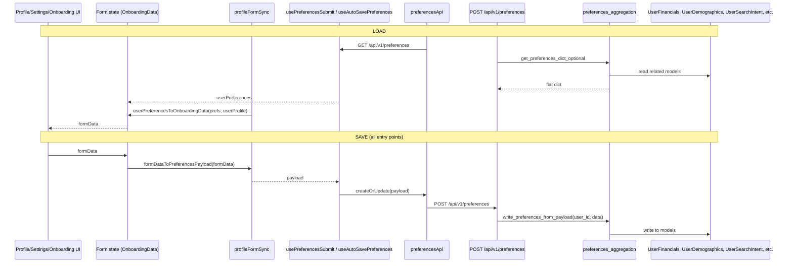

# Profile Page Fields: Full Process Map, Audit, and Fix Plan (with Onboarding)

## 1. End-to-end process map

**Key files**

- **Client load:** [Client/packages/features/profile/utils/profileFormSync.ts](Client/packages/features/profile/utils/profileFormSync.ts) — `userPreferencesToOnboardingData(prefs, userProfile)`.
- **Client save:** Same file — `formDataToPreferencesPayload(formData)`; used by **submitHandler** and **useAutoSavePreferences**.
- **Server read:** [Server/app/services/aggregation/preferences_aggregation.py](Server/app/services/aggregation/preferences_aggregation.py) — `_build_preferences_dict()`.
- **Server write:** Same file — `write_preferences_from_payload()`.

---

## 2. All save entry points (profile, settings, onboarding, auto-save)

Every path that persists preferences uses the same payload transform and API:

| Entry point | Trigger | Flow | Payload |
|-------------|---------|------|--------|
| **Onboarding (web)** | User completes steps and submits | OnboardingPage → OnboardingFeature → useOnboardingForm (web) → useOnboardingFormCore → **handleSubmit** → **handleSubmitUtil** → formDataToPreferencesPayload(formData) → submitPreferences(payload) → preferencesApi.createOrUpdate(payload) | Same |
| **Onboarding (native)** | User completes steps and taps submit | OnboardingScreen.native → useOnboardingForm (native) → useOnboardingFormCore → same **handleSubmitUtil** → same formDataToPreferencesPayload → same API | Same |
| **Profile / Settings (explicit Save)** | User clicks Save | ProfileFeature / Settings / ProfileScreen → handleSubmitUtil → formDataToPreferencesPayload → usePreferencesSubmit() → createOrUpdate(payload) | Same |
| **Settings / criteria (auto-save)** | Field change (debounced) | PreferencesFormContent / DefineCriteriaSection / SetBudgetSection → useAutoSavePreferences → formDataToPreferencesPayload → preferencesApi.createOrUpdate(payload) | Same |

So **fixing formDataToPreferencesPayload** (and backend write) fixes **all** of these: onboarding web, onboarding native, profile save, settings save, and auto-save.

---

## 3. Onboarding variations: agent vs non-agent

### 3.1 Step sets (what the user sees and fills)

- **Web onboarding steps** come from `getOnboardingStepsUi(formData)` → `getOnboardingSteps({ excludeFinancial: true, isAgent })` in [profileStepsUi.tsx](Client/packages/features/profile/components/profilePicture/profileStepsUi.tsx) and [steps.ts](Client/packages/features/profile/utils/steps.ts).
- **Mobile onboarding steps** from `getOnboardingStepsMobile({ isAgent })` → same `getOnboardingSteps({ excludeFinancial: true, isAgent })`.

**When is_agent is "yes" or "am_agent" (agent path):**

- Steps: **Demographics (About You)** → **Professional Info (agent)** only. No housing, location, or financial steps.
- Form collects: demographics (name, is_agent, age, children_count, etc.) + all **agent_*** fields (brokerage, licenses, bio, zips, etc.).
- On submit: `formDataToPreferencesPayload` **keeps** `is_agent` and all `agent_*` keys; strips only `name`. Backend writes User.is_agent, UserDemographics, and **UserAgentProfile** (and creates/updates UserSearchIntent etc. if any keys present).

**When is_agent is not yes/am_agent (non-agent / buyer path):**

- Steps: **Demographics (About You)** → **Housing** → **Location**. No financial, no communication, no agent step.
- Form collects: demographics + housing (preferred_housing_type, preferred_bedrooms, preferred_bathrooms, etc.) + location (important_locations, walkability, etc.).
- On submit: `formDataToPreferencesPayload` **strips all agent_*** keys; keeps housing_type (once we add it), preferred_bedrooms_min/max, preferred_bathrooms_min/max, important_locations, etc. Backend writes User, UserDemographics, UserSearchIntent, UserImportantLocation, UserIntentAttribute; **does not** write UserAgentProfile (and deletes it if user was previously agent).

### 3.2 Validation (onboarding)

- **Web:** `validateOnboardingData` uses [REQUIRED_FIELDS_ONBOARDING](Client/packages/features/profile/utils/constants.ts): `is_agent`, `age`, `children_count` = true; housing/location/agent fields not required.
- **Mobile:** `validateOnboardingDataMobile` uses **REQUIRED_FIELDS_ONBOARDING_MOBILE** (same as web).
- So for **agent** onboarding we only require demographics + is_agent; for **non-agent** we require demographics; housing and location are optional but when filled must be persisted (hence need correct payload keys).

### 3.3 Backend behavior (agent vs non-agent)

- **is_agent:** Written only if user is not already an agent (`if not getattr(u, "is_agent", False)`); value from payload `yes`/`am_agent`/`true`/`1`.
- **Agent profile:** If `user.is_agent` is True, payload `agent_*` fields are written via `_write_agent_profile_from_payload`. If user is not agent, `UserAgentProfile` rows are **deleted**. So agent onboarding submit correctly creates/updates agent profile; non-agent submit never sends agent_* (stripped in payload) and backend leaves or deletes agent profile as above.

### 3.4 Ensuring onboarding (all variations) save and function properly

1. **Single payload transform** — All entry points (including both onboarding flows) go through `formDataToPreferencesPayload`. So:
   - Add **housing_type** (from preferred_housing_type), **preferred_bedrooms_min/max**, **preferred_bathrooms_min/max** to the payload so **non-agent** onboarding housing and location data persist.
   - Keep **agent_*** inclusion when `isAgentFormData(formData)` so **agent** onboarding agent_* data persists.
2. **Backend write** — Add **preferred_bathrooms_min/max** handling in `write_preferences_from_payload`; ensure **housing_type** is received (client sends it). No change needed for agent path (already writes agent_* when user is agent).
3. **Load (returning users)** — When we fix `userPreferencesToOnboardingData` to map `housing_type` → preferred_housing_type and preferred_bedrooms_min/max and preferred_bathrooms_min/max → form keys, **profile/settings** and any **return-to-onboarding** flow will show saved data. First-time onboarding has no API load (draft or empty form).
4. **Draft persistence** — Onboarding uses `getOnboardingDraftFromStorage` / `persistOnboardingDraft(formData)`. Form state is OnboardingData; draft is not the API. No change needed for draft; only API round-trip and payload need to be correct.

**Checklist for onboarding after fixes**

- **Non-agent (web):** Submit with demographics + housing + location → reload or open profile → housing type, bedrooms, bathrooms, important_locations appear and persist.
- **Non-agent (native):** Same.
- **Agent (web):** Submit with demographics + Professional Info → backend has is_agent and UserAgentProfile populated; no housing/location required.
- **Agent (native):** Same.

---

## 4. Root causes: field mapping and coverage gaps (unchanged)

### 4.1 Load: API key ≠ form key

| API returns | Form expects | Result |
|-------------|--------------|--------|
| housing_type | preferred_housing_type | Never mapped — housing type does not load. |
| preferred_bedrooms_min/max | preferred_bedrooms, preferred_bedrooms_max | Never mapped — bedrooms do not load. |
| preferred_bathrooms_min/max | preferred_bathrooms, preferred_bathrooms_max | Same — bathrooms do not load. |

### 4.2 Load: API never returns these

- why_joining_silverkey (in DB, not in _build_preferences_dict).
- marital_status, children_count (not in any model).

### 4.3 Save: form key ≠ backend expected key

- preferred_housing_type (form) → backend expects housing_type.
- preferred_bedrooms / preferred_bedrooms_max → backend expects preferred_bedrooms_min, preferred_bedrooms_max.
- preferred_bathrooms / preferred_bathrooms_max → backend expects preferred_bathrooms_min, preferred_bathrooms_max; **and** write block does not handle bathroom fields at all.

### 4.4 important_locations shape

- API: label, address, max_commute_minutes, commute_mode. Client maps only address, commute_tolerance. Align max_commute_minutes ↔ commute_tolerance and optionally label/commute_mode for round-trip.

### 4.5 Name and PreferencesFormContent

- Pass userProfile into userPreferencesToOnboardingData where PreferencesFormContent initializes form so name is set everywhere.

---

## 5. Audit strategy (before and after fixes)

- **Field inventory:** One list per section (demographics, financial, housing, location, communication, agent) with form key, API key(s) GET/POST, backend model/column, and load/save status.
- **Unit tests (client):** Load: fixture with backend keys (housing_type, preferred_bedrooms_min/max, preferred_bathrooms_min/max) → userPreferencesToOnboardingData → assert form keys populated. Save: formDataToPreferencesPayload → assert payload has housing_type, preferred_bedrooms_min/max, preferred_bathrooms_min/max, important_locations shape.
- **Backend test:** write_preferences_from_payload with housing_type, preferred_bathrooms_min/max, then get_preferences_dict_optional round-trip.
- **Manual / E2E:** Onboarding non-agent (web + native), onboarding agent (web + native), profile save, settings auto-save; then reload and confirm all filled fields persist.

---

## 6. Recommended fixes (order)

1. **Document** field contract and add audit tests (load/save mapping, backend round-trip).
2. **Client load** — userPreferencesToOnboardingData: map housing_type → preferred_housing_type; preferred_bedrooms_min/max → preferred_bedrooms, preferred_bedrooms_max; preferred_bathrooms_min/max → preferred_bathrooms, preferred_bathrooms_max; important_locations (max_commute_minutes → commute_tolerance, etc.).
3. **Client save** — formDataToPreferencesPayload: add housing_type from preferred_housing_type; add preferred_bedrooms_min/max and preferred_bathrooms_min/max from form; add preferred_bathrooms_min/max; align important_locations (commute_tolerance → max_commute_minutes, label, commute_mode as needed).
4. **Backend write** — preferred_bathrooms_min/max in write_preferences_from_payload; confirm housing_type; add why_joining_silverkey read/write if desired.
5. **Backend read** — why_joining_silverkey in _build_preferences_dict if persisted.
6. **Name and store** — userProfile in PreferencesFormContent init; optional React Query → store sync for preferences.
7. **Re-run audit** — tests + manual for profile, settings, **onboarding web, onboarding native, agent and non-agent**; fix any remaining gaps.

This order ensures one transform and one backend write path serve **profile, settings, onboarding (web + native, agent + non-agent), and auto-save**, and that all filled fields save and load correctly.
