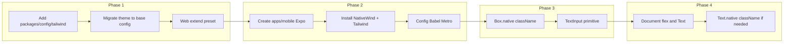

# Centralize Tailwind, Add NativeWind Mobile, and Cross-Platform Primitives

## Current state (summary)

- **[apps/web/tailwind.config.ts](Client/apps/web/tailwind.config.ts)** imports `colors`, `spacing` (as spacingMap), `breakpoints`, `fontFamily`, `fontSize` from `packages/design-tokens` and defines `theme.extend` (animations, keyframes, spacing, minHeight, minWidth, maxWidth, aspectRatio, zIndex). Content scans only `apps/web` paths.
- **[packages/design-tokens](Client/packages/design-tokens)** already exists and exports tokens from `tokens/` (breakpoints, colors, spacing, typography). Used as single source of truth.
- **packages/ui primitives**: [Box.web.tsx](Client/packages/ui/components/primitives/box/Box.web.tsx) uses `
`; [Box.native.tsx](Client/packages/ui/components/primitives/box/Box.native.tsx) uses `<View style={style}>` (no `className` / NativeWind yet). [Text](Client/packages/ui/components/primitives/text/) has `.web` and `.native`; native uses `style`. [PRIMITIVES_RULE.md](Client/packages/ui/components/PRIMITIVES_RULE.md) specifies an Input primitive at `primitives/input/` (Input.web / Input.native); currently only [form/Input.web.tsx](Client/packages/ui/components/form/Input.web.tsx) (styled) and [AccessibleTextInput](Client/packages/ui/components/form/AccessibleTextInput.tsx) exist — no `primitives/input/` yet.
- **apps/mobile**: Root [package.json](Client/package.json) scripts reference `@silverkey/mobile` (dev:mobile, ios, android), but there is no `apps/mobile` in the repo; it is to be created in Phase 2.
- **Workspace**: [pnpm-workspace.yaml](Client/pnpm-workspace.yaml) includes `apps/*` and `packages/*`. Resolve aliases in [tsconfig.base.json](Client/tsconfig.base.json) and [vite.config.ts](Client/apps/web/vite.config.ts) point to `packages/ui` and other packages.

---

## Phase 1: Centralize Tailwind configuration

**Goal:** Single design-system source so `apps/web` and future `apps/mobile` use the same theme.

1. **Create shared Tailwind config under `packages/config/tailwind`**
   - Add **`packages/config/tailwind/`** (no separate package required if `packages/config` is the single config package): create `tailwind.config.base.ts` (or `index.ts`) that:
     - Imports `colors`, `spacing` (spacingMap), `breakpoints`, `fontFamily`, `fontSize` from `@silverkey/design-tokens` (or `packages/design-tokens` per existing resolution).
     - Exports a **Tailwind config object** with no `content` and no `plugins` (or empty), and a `theme.extend` (and `theme.screens` if desired) that matches the current [apps/web/tailwind.config.ts](Client/apps/web/tailwind.config.ts) theme (screens, colors, fontFamily, fontSize, animation, keyframes, spacing, minHeight, minWidth, maxWidth, aspectRatio, zIndex).
   - This file is the **preset**: consumers will use `presets: [require('packages/config/tailwind')]` or the path/alias that resolves to this module (e.g. `import baseConfig from 'packages/config/tailwind'` then `presets: [baseConfig]`). Ensure the export is consumable from both ESM (Vite) and CJS (Metro) if needed.
   - If `packages/config` has no root `package.json`, ensure `packages/config` (or a parent) declares a dependency on `tailwindcss` and `@silverkey/design-tokens` so the preset can be built. If config is a loose folder, add a minimal `packages/config/tailwind/package.json` only if the workspace requires it for resolution; otherwise a single `tailwind.config.base.ts` (or `index.ts`) under `packages/config/tailwind/` is enough, and apps resolve it via path (e.g. `../../packages/config/tailwind` or a tsconfig/vite alias like `packages/config/tailwind`).

2. **Refactor apps/web**
   - Update [apps/web/tailwind.config.ts](Client/apps/web/tailwind.config.ts): import the shared preset from `packages/config/tailwind` (path or alias), set `presets: [sharedConfig]`, and keep only `content` (and any web-only `plugins`) in the web config. Do not duplicate theme definitions.

3. **Verification**
   - Run web build and confirm styles and design tokens still apply. No change to `packages/design-tokens` API.

---

## Phase 2: Set up apps/mobile with NativeWind

**Goal:** New Expo app that shares the same Tailwind/design system and can style `packages/ui` with NativeWind.

1. **Create `apps/mobile`**
   - Scaffold with Expo (e.g. `npx create-expo-app@latest apps/mobile` or equivalent) so the app has `package.json` with name `@silverkey/mobile`, and standard Expo entry (e.g. `App.tsx`, `app.json`). Ensure it lives under `Client/apps/mobile` and is included in the pnpm workspace.

2. **Install dependencies**
   - In `apps/mobile`: add `nativewind` and `tailwindcss` (align version with web, e.g. ^3.4.x for Tailwind 3). Use NativeWind v4 (stable with Tailwind 3 and Expo).

3. **Tailwind config for mobile**
   - Add `apps/mobile/tailwind.config.ts` (or `.js` if CJS):
     - Set `presets: [require('../../packages/config/tailwind')]` (or the path/alias that resolves to the shared preset in `packages/config/tailwind`).
     - Set `content` to include:
       - `./**/*.{ts,tsx}` or `apps/mobile/**/*.{ts,tsx}`
       - `../../packages/ui/**/*.{ts,tsx}` (so shared primitives get scanned).

4. **Global CSS**
   - Add `apps/mobile/global.css` (or similar) with Tailwind directives: `@tailwind base; @tailwind components; @tailwind utilities;` and ensure this file is the single entry used by NativeWind.

5. **Babel**
   - In `apps/mobile/babel.config.js`: add `nativewind/babel` to `presets` (after `babel-preset-expo`).

6. **Metro**
   - In `apps/mobile/metro.config.js`: use `withNativeWind(config, { input: './global.css' })` (or the path to the global CSS). Ensure Metro watches the workspace: set `watchFolders` (or equivalent) so that `packages/ui` (and optionally `packages/config/tailwind`) are watched for changes. Use `require('expo/metro-config')` or `@expo/metro-config` and merge with the NativeWind wrapper.

7. **TypeScript / resolver**
   - Ensure `apps/mobile` can resolve `packages/config/tailwind` and `packages/ui` (e.g. tsconfig paths or Metro `resolver.extraNodeModules` / symlinks). If the repo uses a single root tsconfig, add path mapping for `packages/config/*` if not already present.

8. **Verification**
   - Start the app (`pnpm dev:mobile` or equivalent), confirm no Metro resolution errors, and that a simple screen using `className` on a View (or Box) applies styles.

---

## Phase 3: Cross-platform primitives (Box, TextInput)

**Goal:** Box uses `className` on both platforms; a new TextInput primitive normalizes web vs native change events.

1. **Box**
   - **Box.web.tsx:** Keep as-is: `
` (already correct).
   - **Box.native.tsx:** Switch to **className** instead of `style` so NativeWind can apply. Use NativeWind’s pattern: `<View className={className} {...props}>` and remove the direct `style` prop from the primitive (or support both if NativeWind v4 documents that). This requires NativeWind to be set up (Phase 2).

2. **TextInput primitive (new)**
   - Add **shared types** in `packages/ui/components/primitives/input/TextInput.types.ts` (or `Input.types.ts` to match PRIMITIVES_RULE naming):
     - Define a unified props interface: include `onValueChange?: (text: string) => void`, plus common props (value, placeholder, editable, accessibilityLabel/label, className, etc.). Omit web-only and native-only event types from the shared type; extend in platform files.
   - **TextInput.web.tsx:** Render `<input type="text" className={className} ... />`. Map `onChange` (React.FormEvent) to call `onValueChange?.(event.currentTarget.value)`. Forward ref to the input element.
   - **TextInput.native.tsx:** Render React Native’s `<TextInput className={className} ... />`. Map `onChangeText` to `onValueChange`. Forward ref to RN TextInput. Use the same shared types for the public API.
   - Add **barrel** `primitives/input/index.ts` that re-exports the platform-specific Input/TextInput (so bundler resolves `.web`/`.native`) and exports the shared types. Naming: PRIMITIVES_RULE says “Input”; you can name the files `Input.web.tsx` / `Input.native.tsx` and the types `Input.types.ts` so the rest of the codebase can import `Input` and `onValueChange`. Update [PRIMITIVES_RULE.md](Client/packages/ui/components/PRIMITIVES_RULE.md) if the primitive is named TextInput in code.

3. **Higher-level form/Input**
   - The existing [form/Input.web.tsx](Client/packages/ui/components/form/Input.web.tsx) is a styled, feature-rich component (label, icons, password toggle, etc.). It should eventually use the new primitive under the hood (e.g. render the primitive and add wrapper/label/icons). That refactor can be a follow-up; Phase 3 only adds the primitive and optionally wires form/Input to use it on web. No requirement to change form/Input.web.tsx in this phase unless you want a minimal integration.

---

## Phase 4: Native styling gotchas (flex, Text)

**Goal:** Document and enforce patterns so shared layout and typography work on RN.

1. **Default flex direction**
   - **Document:** In [PRIMITIVES_RULE.md](Client/packages/ui/components/PRIMITIVES_RULE.md) or a short `packages/ui/STYLING_RN.md`, state that React Native defaults to `flex-col`; for predictable cross-platform layout, shared container components should **explicitly** set `flex-row` or `flex-col` (e.g. `className="flex flex-col"` or `className="flex flex-row"`) instead of relying on default. Optionally add a default on Box.native (e.g. `className={cn('flex flex-col', className)}`) so every Box has an explicit direction; only do this if it doesn’t break existing layouts.

2. **Text and typography**
   - **Document:** React Native does not cascade text styles; typography classes must be applied **on the Text primitive**, not on a parent Box. Add this to the same doc and to PRIMITIVES_RULE if not already there.
   - **Text primitive:** Once NativeWind is active, ensure **Text.native.tsx** accepts `className` and passes it to RN `<Text>` so that Tailwind typography classes (e.g. `text-sm`, `font-medium`) work. If NativeWind v4 applies `className` on `Text` automatically, no code change may be needed; otherwise add `className` to the native Text component.

3. **No code changes beyond Box/Text and docs**
   - Phase 4 is primarily documentation and small adjustments (Box.native and Text.native using `className` are already covered in Phase 2/3). No new primitives.

---

## Dependency and resolution notes

- **packages/config/tailwind** will live under the existing config area. If `packages/config` has a root `package.json`, add dependencies there for `tailwindcss` and `@silverkey/design-tokens`; otherwise ensure the app (web/mobile) that runs Tailwind can resolve `packages/config/tailwind` and that the preset file can resolve `@silverkey/design-tokens` (e.g. via workspace or path).
- **Tailwind in Node:** The web Tailwind config runs in Node (Vite/PostCSS). The new preset in `packages/config/tailwind` should import from `@silverkey/design-tokens` (or the same path the web app uses for design-tokens) so the theme builds correctly.
- **Metro and packages:** Metro must be configured to resolve and watch `packages/ui` (and optionally `packages/config/tailwind`). Use `watchFolders` and symlinks or `nodeModules` resolution so that `apps/mobile` can import from `packages/ui` and the shared Tailwind preset.

---

## Order of execution

- Phase 1 first (shared preset under `packages/config/tailwind` and web refactor).
- Phase 2 next (mobile app and NativeWind); then Box.native and TextInput can rely on `className` and NativeWind.
- Phase 3 and 4 can overlap: implement Box + TextInput, then add docs and Text.native `className` if required.

---

## Files to add or touch (concise)

| Phase | Action |
|-------|--------|
| 1 | Add **`packages/config/tailwind/tailwind.config.base.ts`** (or `index.ts`) exporting theme from design-tokens; ensure `packages/config` (or tailwind subfolder) can resolve `@silverkey/design-tokens` and `tailwindcss`. |
| 1 | Edit **`apps/web/tailwind.config.ts`**: preset from `packages/config/tailwind` + content only. |
| 2 | Create **`apps/mobile/`** (Expo), `package.json`, `tailwind.config.ts` (preset: `packages/config/tailwind`), `global.css`, `babel.config.js`, `metro.config.js`. |
| 3 | Edit **`packages/ui/.../box/Box.native.tsx`**: use `className`. Add **`packages/ui/.../primitives/input/TextInput.types.ts`**, **TextInput.web.tsx**, **TextInput.native.tsx**, **index.ts**. |
| 4 | Add or update **`packages/ui`** docs (PRIMITIVES_RULE or STYLING_RN): flex direction, Text typography; ensure Text.native supports `className`. |
