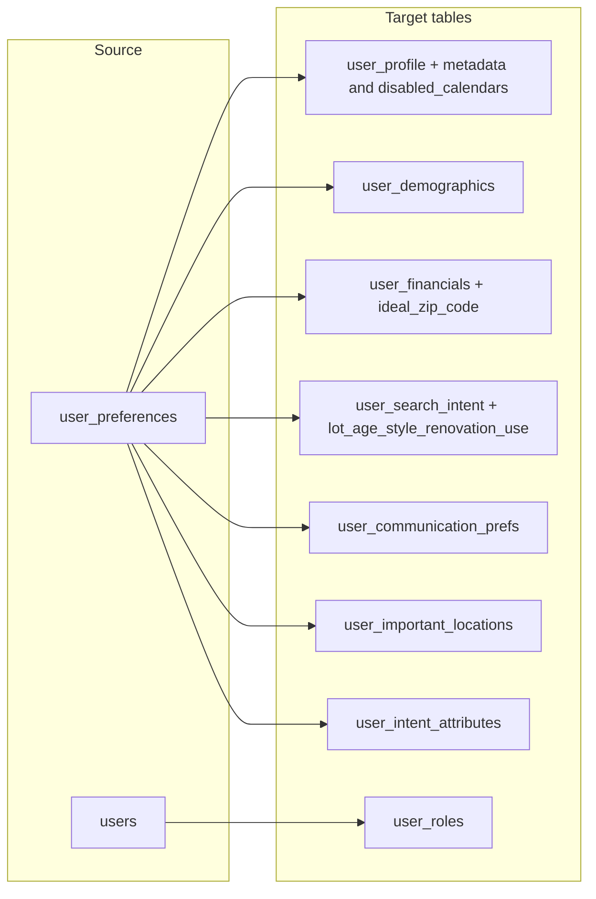

# User Preferences to Split Models – Data Migration Plan (with gaps in proper locations)

## Context

- **Source**: `Server/app/models/user/user_preferences.py` (`user_preferences` table) and legacy columns on `Server/app/models/user/user.py` (`users` table).
- **Target**: Phase 4 split models under `Server/app/models/user/`.
- **Constraint**: No new Alembic migration files (per workspace rules). Schema changes are **model-only** (add columns in `Server/app/models/`); the DBA or existing migration flow will apply schema to the DB. Deliverable includes a **data migration script** and **model edits** so no field is left unmigrated.

---

## Part 1: Add gap columns to target models

So that every `user_preferences` (and relevant User) field has a proper home, add the following columns. Then the data migration will copy into them.

### 1. UserFinancials – add 1 column

| Column            | Type           | Notes                    |
|-------------------|----------------|--------------------------|
| `ideal_zip_code`  | `db.String(10)`| Preferred search zip; nullable. |

**File**: [Server/app/models/user/user_financials.py](Server/app/models/user/user_financials.py)

### 2. UserSearchIntent – add 6 columns

| Column                          | Type              | Notes (all nullable) |
|---------------------------------|-------------------|----------------------|
| `preferred_lot_size`            | `db.String(50)`   | From UserPreferences |
| `preferred_home_age`            | `db.String(50)`   | From UserPreferences |
| `preferred_architectural_style`  | `db.String(100)`  | From UserPreferences |
| `renovation_preference`         | `db.String(100)`  | From UserPreferences |
| `architectural_style_preference` | `db.String(100)`  | From UserPreferences |
| `intended_property_use`         | `db.String(100)`  | From UserPreferences |

**File**: [Server/app/models/user/user_search_intent.py](Server/app/models/user/user_search_intent.py)

### 3. UserProfile – add 4 columns (metadata + calendar)

| Column               | Type        | Notes (all nullable) |
|----------------------|-------------|----------------------|
| `chat_sessions`      | `db.Text`   | JSON array of sentiments |
| `last_updated_section` | `db.String(50)` | Last section updated |
| `data_sources`       | `db.Text`   | JSON array of data sources |
| `disabled_calendars` | `db.Text`   | JSON array of disabled calendar IDs (sync to UserCalendarConnection later if needed) |

**File**: [Server/app/models/user/user_profile.py](Server/app/models/user/user_profile.py)

### 4. Name

- **UserPreferences.name**: Do **not** duplicate into any new table. Name stays on `User` only (per model comment in UserDemographics).

---

## Part 2: Field mapping (source → target) including gaps

### 1. UserProfile (1:1 per user)

| Source (UserPreferences) | Target (UserProfile) |
|--------------------------|----------------------|
| `created_at`             | `created_at`         |
| `updated_at`             | `updated_at`         |
| `preferences_version`    | `profile_version`    |
| `chat_sessions`          | `chat_sessions`     *(new)* |
| `last_updated_section`   | `last_updated_section` *(new)* |
| `data_sources`           | `data_sources`      *(new)* |
| `disabled_calendars`     | `disabled_calendars` *(new)* |

### 2. UserDemographics (1:1 per user)

| Source (UserPreferences) | Target (UserDemographics) |
|--------------------------|----------------------------|
| `age`, `pets`, `occupation`, `gender`, `why_joining_silverkey` | same names |
| `created_at` / `updated_at` | same |

*(Name stays on User; not copied here.)*

### 3. UserFinancials (1:1 per user)

| Source (UserPreferences) | Target (UserFinancials) |
|--------------------------|-------------------------|
| `gross_income`, `home_budget_min`, `home_budget_max`, `credit_score_range`, `down_payment` | same |
| `ideal_zip_code`         | `ideal_zip_code`        *(new)* |
| timestamps               | `created_at` / `updated_at` |

### 4. UserSearchIntent (1:1 per user)

| Source (UserPreferences) | Target (UserSearchIntent) |
|--------------------------|---------------------------|
| `housing_type`, `preferred_bedrooms_min/max`, `preferred_bathrooms_min/max`, `preferred_sqft_min/max`, `preferred_lot_size_min/max`, `preferred_home_age_max`, `days_on_market_max`, `walkability_importance` | same |
| `preferred_lot_size`     | `preferred_lot_size`      *(new)* |
| `preferred_home_age`     | `preferred_home_age`     *(new)* |
| `preferred_architectural_style` | `preferred_architectural_style` *(new)* |
| `renovation_preference`  | `renovation_preference`  *(new)* |
| `architectural_style_preference` | `architectural_style_preference` *(new)* |
| `intended_property_use`  | `intended_property_use`  *(new)* |

**Fallback**: If only `preferred_bedrooms` / `preferred_bathrooms` are set, set both _min and _max to that value.

### 5. UserCommunicationPrefs (1:1 per user)

Unchanged: `communication_frequency`, `information_detail_level`, `has_buyers_agent`, `looking_for_buyers_agent`, timestamps.

### 6. UserImportantLocation (1:N per user)

Unchanged: parse `important_locations` JSON; one row per location; `address`, `commute_tolerance` → `max_commute_minutes`, optional `name`/label.

### 7. UserIntentAttribute (N per user)

Unchanged: `must_have` → `must_have`, `deal_breakers` → `deal_breaker`, `listing_type` → `listing_type`, `preferred_home_features` → `feature`.

### 8. UserRole (from User)

Unchanged: ensure `agent` and/or `buyer` roles from `User.is_agent` and presence of UserPreferences.

---

## Part 3: Data left in place (no delete)

- **user_preferences table**: All rows and columns remain; nothing is deleted. The script only **copies** into the new tables.
- **User table**: No legacy columns removed; only read for role migration.
- **UserPreferences.name**: Not copied (canonical name on User).

---

## Part 4: Implementation steps

1. **Edit models** (allowed under workspace rules):
   - [Server/app/models/user/user_financials.py](Server/app/models/user/user_financials.py): add `ideal_zip_code = db.Column(db.String(10), nullable=True)`.
   - [Server/app/models/user/user_search_intent.py](Server/app/models/user/user_search_intent.py): add the 6 new String columns listed above (all nullable).
   - [Server/app/models/user/user_profile.py](Server/app/models/user/user_profile.py): add `chat_sessions`, `last_updated_section`, `data_sources`, `disabled_calendars` (all nullable, Text or String(50) as in mapping).

2. **Schema in DB**: Either run existing migrations if they are wired to compare models, or add a new Alembic migration **outside this repo’s “do not edit migrations” scope** (e.g. by a separate process) so the new columns exist. The data script assumes the new columns exist.

3. **Data migration script**: Implement the script (e.g. `Server/scripts/migrate_user_preferences_to_split_models.py`) so that for each user with UserPreferences it:
   - Upserts UserProfile (including the new profile metadata and disabled_calendars).
   - Upserts UserDemographics, UserFinancials (including ideal_zip_code), UserSearchIntent (including the 6 new search/preference columns), UserCommunicationPrefs.
   - Replaces UserImportantLocation and UserIntentAttribute for that user (delete existing for user, insert from parsed JSON).
   - Ensures UserRole rows (agent/buyer) from User.
   - Uses one transaction or batched commits, logging, and optional `--dry-run`.

4. **Idempotency**: Script is safe to run multiple times (upserts for 1:1 tables; replace-by-user for 1:N tables; ensure-exists for roles).

---

## Summary diagram (with gaps in proper locations)

All former “gaps” are now assigned: **UserFinancials** (ideal_zip_code), **UserSearchIntent** (preferred_lot_size, preferred_home_age, architectural/renovation/intended_use), **UserProfile** (chat_sessions, last_updated_section, data_sources, disabled_calendars). Name remains only on User.
