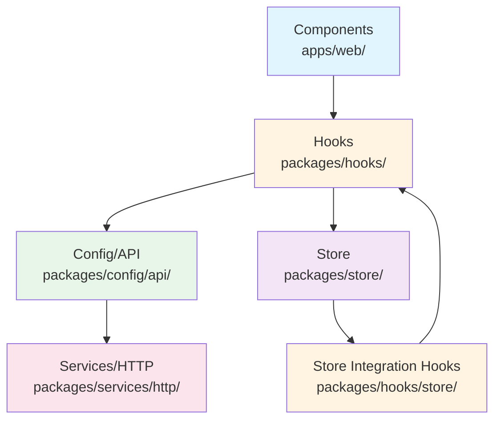

# Frontend Architecture Documentation

## Overview

The SilverKey frontend follows a strict layered architecture with clear separation of concerns. This document describes the architecture, data flow, and best practices.

## Architecture Diagram



## Layer Descriptions

### 1. Components Layer (`apps/web/`)

**Purpose**: React components and pages - the UI layer.

**Responsibilities**:
- Render UI
- Handle user interactions
- Compose hooks for data and state
- No direct API calls or business logic

**Allowed Imports**:
- `packages/hooks/*` - All hooks
- `packages/store/*` - Store selectors (read-only)
- `packages/schemas/*` - Type definitions
- `packages/utils/*` - Utility functions
- `packages/contexts/*` - React contexts

**Forbidden Imports**:
- ❌ `packages/config/api/*` - Use hooks instead
- ❌ `packages/services/*` - Use hooks instead

**Example**:
```typescript
// ✅ CORRECT
import { useSavedHomesData } from "../../../packages/hooks/data/useSavedHomesData";
import { useAuthStore } from "../../../packages/store/auth.slice";

export default function SavedPage() {
  const { savedHomes, saveHome } = useSavedHomesData();
  const user = useAuthStore((s) => s.user);
  // ...
}

// ❌ WRONG
import { userApi } from "../../../packages/config/api/user";
import { agentService } from "../../../packages/services/agent";
```

### 2. Hooks Layer (`packages/hooks/`)

**Purpose**: React hooks for data fetching, store integration, and UI state.

#### 2.1 Data Hooks (`hooks/data/*`)

**Purpose**: React Query hooks for data fetching.

**Responsibilities**:
- Fetch data using React Query
- Use `config/api/*` for API calls
- Transform and cache data
- Handle loading and error states

**Allowed Imports**:
- `packages/config/api/*` - API clients
- `packages/store/*` - Store selectors (read-only)
- `packages/schemas/*` - Type definitions
- `packages/services/http/*` - HTTP utilities (if needed)
- `packages/services/security/*` - Security utilities (if needed)

**Forbidden Imports**:
- ❌ `packages/services/*` (business logic services) - Use `config/api` instead

**Example**:
```typescript
// ✅ CORRECT
import { userApi } from "../../config/api/user";
import { useQuery } from "@tanstack/react-query";

export const useSavedHomesData = () => {
  const { data, isLoading, error } = useQuery({
    queryKey: ["savedHomes"],
    queryFn: () => userApi.getFavoriteHomes(),
  });
  return { savedHomes: data ?? [], isLoading, error };
};

// ❌ WRONG
import { savedHomesService } from "../../services/savedHomes";
```

#### 2.2 Store Integration Hooks (`hooks/store/*`)

**Purpose**: Hooks that integrate data hooks with Zustand stores.

**Responsibilities**:
- Sync data from hooks to stores
- Provide unified interface for components
- Handle store updates

**Allowed Imports**:
- `packages/hooks/data/*` - Data hooks
- `packages/store/*` - Store slices
- `packages/schemas/*` - Type definitions

**Example**:
```typescript
// ✅ CORRECT
import { useSecureAuth } from "../data/useSecureAuth";
import { useAuthStore } from "../../store/auth.slice";

export function useAuthStoreIntegration() {
  const { user, isAuthenticated } = useSecureAuth();
  const setUser = useAuthStore((s) => s.setUser);
  
  useEffect(() => {
    setUser(user);
  }, [user, setUser]);
}
```

#### 2.3 UI Hooks (`hooks/ui/*`)

**Purpose**: Pure UI state management hooks.

**Responsibilities**:
- Manage UI-specific state (modals, toasts, etc.)
- No API calls or business logic

**Example**:
```typescript
// ✅ CORRECT
export function useModal(initialState = false) {
  const [isOpen, setIsOpen] = useState(initialState);
  const open = useCallback(() => setIsOpen(true), []);
  const close = useCallback(() => setIsOpen(false), []);
  return { isOpen, open, close };
}
```

### 3. Config/API Layer (`packages/config/api/`)

**Purpose**: Thin, type-safe API client wrappers.

**Responsibilities**:
- Define API endpoints
- Type request/response data
- Use HTTP utilities for actual requests
- Handle API-specific transformations

**Allowed Imports**:
- `packages/services/http/*` - HTTP client utilities
- `packages/services/security/*` - Security utilities
- `packages/schemas/*` - Type definitions

**Forbidden Imports**:
- ❌ `packages/services/*` (business logic) - Only HTTP/security utilities
- ❌ `packages/hooks/*` - No React dependencies
- ❌ `packages/store/*` - No state management

**Example**:
```typescript
// ✅ CORRECT
import { apiPost, apiGet } from "../../services/http/compatibility";
import type { LoginData, AuthResponse } from "../../schemas/api";

export const authApi = {
  login: async (data: LoginData): Promise<AuthResponse> => {
    return apiPost<AuthResponse>("/api/v1/auth/login", data);
  },
  getProfile: async (): Promise<AuthResponse> => {
    return apiGet<AuthResponse>("/api/v1/user/profile");
  },
};
```

### 4. Services Layer (`packages/services/`)

**Purpose**: Business logic orchestration and infrastructure services.

#### 4.1 Business Logic Services

**Responsibilities**:
- Orchestrate complex business logic
- Coordinate multiple API calls
- Manage service-level state
- Provide singleton instances

**Allowed Imports**:
- `packages/config/api/*` - API clients
- `packages/services/http/*` - HTTP utilities
- `packages/services/security/*` - Security utilities
- `packages/schemas/*` - Type definitions

**Forbidden Imports**:
- ❌ `packages/hooks/*` - Services are framework-agnostic
- ❌ `packages/store/*` - Pass state as parameters instead
- ❌ `packages/apps/web/*` - No component dependencies

**Example**:
```typescript
// ✅ CORRECT
import { agentApi } from "../config/api/agent";
import { createAbortManager } from "./http";

export class AgentService {
  private abortManager = createAbortManager();
  
  async fetchClients() {
    const response = await agentApi.getClients();
    // Business logic here
    return response.clients ?? [];
  }
}

// ❌ WRONG
import { useAgentClients } from "../hooks/data/useAgentClients";
import { useAuthStore } from "../store/auth.slice";
```

#### 4.2 HTTP Services (`services/http/*`)

**Purpose**: Low-level HTTP client implementation.

**Responsibilities**:
- Handle HTTP requests/responses
- Manage retries and timeouts
- Handle authentication
- Error handling

**Example**:
```typescript
// ✅ CORRECT
export class HttpClient {
  async request<T>(endpoint: string, options: HttpClientOptions): Promise<T> {
    // HTTP implementation
  }
}
```

#### 4.3 Security Services (`services/security/*`)

**Purpose**: Security utilities and logging.

**Responsibilities**:
- PII masking
- Secure logging
- Error reporting
- Security event tracking

### 5. Store Layer (`packages/store/`)

**Purpose**: Global state management with Zustand.

**Responsibilities**:
- Define application state structure
- Provide state selectors and setters
- Persistence middleware
- DevTools integration

**Allowed Imports**:
- `packages/schemas/*` - Type definitions

**Forbidden Imports**:
- ❌ `packages/config/api/*` - No API calls in store
- ❌ `packages/services/*` - No business logic in store
- ❌ `packages/hooks/*` - Store is framework-agnostic

**Example**:
```typescript
// ✅ CORRECT
import { create } from "zustand";
import type { UserProfile } from "../schemas/user";

export const useAuthStore = create<AuthState>()((set) => ({
  user: null,
  setUser: (user: UserProfile | null) => set({ user }),
}));
```

## Data Flow

### Fetching Data

```
Component
  ↓ calls hook
Data Hook (useQuery)
  ↓ calls API
Config/API (authApi.login)
  ↓ uses HTTP
Services/HTTP (HttpClient)
  ↓ makes request
Backend API
```

### Updating Store

```
Component
  ↓ calls hook
Store Integration Hook
  ↓ uses data hook
Data Hook (fetches data)
  ↓ updates store
Store (Zustand)
  ↓ notifies
Component (re-renders)
```

### Example: Saving a Home

```typescript
// 1. Component calls hook
const { saveHome } = useSavedHomesData();

// 2. Hook uses mutation
const saveHomeMutation = useMutation({
  mutationFn: async (property) => {
    // 3. Hook calls API
    return await userApi.addFavoriteHome({ home: property });
  },
});

// 4. API uses HTTP client
export const userApi = {
  addFavoriteHome: async (data) => {
    return apiPost("/api/v1/user/favorite-homes/add", data);
  },
};

// 5. HTTP client makes request
// 6. Store is updated via hook's onSuccess
```

## Common Patterns

### Pattern 1: Creating a Data Hook

```typescript
// packages/hooks/data/useAgentTodos.ts
import { useQuery, useMutation } from "@tanstack/react-query";
import { agentApi } from "../../config/api/agent";
import { queryKeys } from "../../config/query/keys";

export const useAgentTodos = () => {
  const { data, isLoading, error } = useQuery({
    queryKey: queryKeys.agent.todos(),
    queryFn: () => agentApi.getTodos(),
  });

  const createTodo = useMutation({
    mutationFn: (data: CreateTodoRequest) => agentApi.createTodo(data),
    onSuccess: () => {
      queryClient.invalidateQueries({ queryKey: queryKeys.agent.todos() });
    },
  });

  return {
    todos: data ?? [],
    isLoading,
    error,
    createTodo: createTodo.mutateAsync,
  };
};
```

### Pattern 2: Using a Hook in Component

```typescript
// apps/web/pages/DashboardPage.tsx
import { useAgentTodos } from "../../../packages/hooks/data/useAgentTodos";

export default function DashboardPage() {
  const { todos, isLoading, createTodo } = useAgentTodos();
  
  const handleCreate = async () => {
    await createTodo({ title: "New Todo" });
  };
  
  return (
    <div>
      {isLoading ? "Loading..." : todos.map(todo => <div key={todo.id}>{todo.title}</div>)}
    </div>
  );
}
```

### Pattern 3: Store Integration Hook

```typescript
// packages/hooks/store/useAgentTodosStoreIntegration.ts
import { useAgentTodos } from "../data/useAgentTodos";
import { useAgentStore } from "../../store/agent.slice";

export function useAgentTodosStoreIntegration() {
  const { todos, isLoading } = useAgentTodos();
  const setTodos = useAgentStore((s) => s.setTodos);
  
  useEffect(() => {
    setTodos(todos);
  }, [todos, setTodos]);
  
  return { todos, isLoading };
}
```

## Migration Guide

### Migrating Component Using API Directly

**Before**:
```typescript
import { userApi } from "../../../packages/config/api/user";

function Component() {
  useEffect(() => {
    userApi.getProfile().then(setUser);
  }, []);
}
```

**After**:
```typescript
import { useUserData } from "../../../packages/hooks/data/useUserData";

function Component() {
  const { user } = useUserData();
}
```

### Migrating Hook Using Service

**Before**:
```typescript
import { agentService } from "../../services/agent";

export const useAgentClients = () => {
  const [clients, setClients] = useState([]);
  useEffect(() => {
    agentService.fetchClients().then(setClients);
  }, []);
  return { clients };
};
```

**After**:
```typescript
import { agentApi } from "../../config/api/agent";
import { useQuery } from "@tanstack/react-query";

export const useAgentClients = () => {
  const { data } = useQuery({
    queryKey: ["agent", "clients"],
    queryFn: () => agentApi.getClients(),
  });
  return { clients: data?.clients ?? [] };
};
```

## Best Practices

1. **Always use hooks in components** - Never import `config/api` or `services` directly
2. **Hooks use config/api** - Data hooks should use `config/api/*`, not `services/*`
3. **Services are framework-agnostic** - Services should not import hooks or React-specific code
4. **Store is updated via hooks** - Components should not mutate store directly
5. **Type-only imports are OK** - Importing types from `config/api` is allowed
6. **Create hooks for missing functionality** - If a hook doesn't exist, create it

## Related Documentation

- [Architecture Violations Report](../ARCHITECTURE_VIOLATIONS.md) - List of current violations
- [Cursor Rules](../.cursor/rules/frontend-architecture.mdc) - Strict architecture rules
