# SearchPage.tsx Architecture Map

## Overview

- **Purpose**: Orchestrates search bootstrap, isochrone-driven search, layout selection (mobile/desktop), and interactions (tabs, paging, save/remove, details modal).
- **Key Concepts**: unified cache, Zustand consolidated store, isochrone flow, Google Maps readiness, mobile vs. desktop rendering.

### Layered Flow Graph (rendered)

Embed (source): `documentation/graphs/searchpage-layered.mmd`

### Detailed Import Graph (rendered)

Embed (source): `documentation/graphs/searchpage-imports.mmd`

### Control/Data Flow (succinct)

- **Bootstrapping**: `useSearchBootstrap` loads cached results (unified cache keyed by preferences version). If found, sets `searchResults`, `hasSearched`, `currentPage=0`, `showPropertyModals=true`.
- **Auto-search**: When local storage is ready and no results, triggers `useIsochroneFlow.runIsochroneSearch()`.
- **Isochrone Search**: `searchPropertiesInIsochroneCallback` sets stages, fetches `preferencesApi.get()`, then `searchService.searchByPolygon({ user_preferences, perBucketPages })`. Maps results via `mapBackendPropertyToDetails`, saves to store and unified cache, updates `hasSearched`, `isSearching`, `currentPage`, `showPropertyModals`.
- **Layouts**: `useMobile` selects `MobileSearchLayout` vs `DesktopSearchLayout`. Both wire map container and list UI; mobile also has `SearchMobileHeader` and carousel collapse state.
- **Details**: `usePropertyDetails` provides `fetchPropertyDetails` and `selectedProperty` for `PropertyDetailsModal`.
- **Saved Homes**: `useSavedHomesData` exposes `savedHomes`, `saveHome`, `removeSavedHome`, and `isHomeSaved`; addresses mirrored in `favoriteAddresses` store slice.
- **Pagination/Tab**: `currentPage`, `activeTab` kept in store; handlers reset page on tab changes and gate `showPropertyModals`.
- **Map Readiness**: `isMapReady` managed locally to time overlays/loader; Google Maps loaded via `useGoogleMapsStore.loadGoogleMaps`.

### Key Modules (very brief)

- `useConsolidatedSearchStore (core/store/search.ts)`: Central state: results, flags, UI, favorites, cache persistence.
- `useSearchBootstrap (features/search/hooks/data/useSearch.ts)`: Hydrates from unified cache based on preferences version.
- `useIsochroneFlow (features/search/hooks/data/useIsochroneFlow.ts)`: Orchestrates fetching isochrone and running property search; dedupes concurrent requests.
- `searchService.searchByPolygon (features/search/services/SearchService.ts)`: Calls API `/api/v1/search/properties-by-polygon` and returns properties.
- `preferencesApi.get (core/config/api/preferences)`: Loads user preferences required by backend.
- `mapBackendPropertyToDetails (features/search/lib/mapping.ts)`: Normalizes backend property to `PropertyDetails`.
- `cacheUtils/memoryUtils (features/search/hooks/unifiedCache)`: Simple in-memory/local storage caching utilities.
- `usePropertyDetails (core/hooks/data/usePropertyDetails)`: Fetches and exposes selected property details.
- `useSavedHomesData (core/hooks/data/useSavedHomesData)`: Saved homes CRUD and `isHomeSaved` lookup.
- `MobileSearchLayout / DesktopSearchLayout`: Compose map area + lists/header; forward props to `SearchMapContainer` and child UI.
- `SearchMapContainer`: Hosts map ref and primes/uses isochrone for overlays.
- `SearchMobileHeader`: Mobile actions for prefs and search trigger.
- `PropertyDetailsModal`: Displays details; integrates with saved state.

### Important Behaviors

- **Auto Tab Switch**: After search completes, auto-switches to results unless user overrode tab.
- **Per-page**: `PROPERTIES_PER_PAGE = 1` for carousel-like navigation.
- **Logging**: Throttled state logs; lightweight errors via `normalizeError`/`logError`.
- **Persistence**: Store persists key fields; unified cache saves result arrays with preferences version.

### File References

- `pages/Search/SearchPage.tsx`
- `core/store/search.ts`
- `features/search/hooks/data/useSearch.ts`
- `features/search/hooks/data/useIsochroneFlow.ts`
- `features/search/services/SearchService.ts`
- `features/search/lib/mapping.ts`
- `core/config/api/preferences.ts`
- `features/search/components/desktop/DesktopSearchLayout.tsx`
- `features/search/components/mobile/MobileSearchLayout.tsx`
- `features/search/components/SearchMapContainer.tsx`
- `components/modals/PropertyDetailsModal.tsx`
- `features/search/components/mobile/SearchMobileHeader.tsx`
