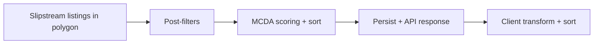

# Search filter + match score audit (SIL-269)

> **Status:** Audit complete (2026-06-17)  
> **Linear:** [SIL-269](https://linear.app/silverkey/issue/SIL-269/audit-search-filters-home-score-calibration-filter-bugs-score)  
> **Code:** `Server/app/services/search/`, `Client/packages/features/search/`

Hands-on QA and code review of buyer polygon search: post-filters, strict preference mode, and MCDA match scoring.

## Pipeline summary

Polygon search runs in two distinct phases on the server:

1. **Post-filters (hard)** — `Server/app/services/search/polygon/polygon_post_filters/` removes listings that fail numeric or categorical constraints.
2. **Match score (soft)** — `score_and_sort_properties` in `scoring_helpers.py` ranks survivors with MCDA (`score_listing_mcda`) on a 1–99 display scale.

The client displays backend `score` as `SearchResult._score` and sorts by it when `resultsOrderBy === "match_score"`. It does **not** re-run post-filters locally; `filteredSearchResults` in `useSearchPageData` only removes “not interested” homes and applies display sort.



## Filter audit findings

| Filter | Always applies when pref set? | Strict-only? | Notes |
|--------|------------------------------|--------------|-------|
| Price min/max | Yes | No | Listings with unknown price are kept |
| Beds / baths min/max | Yes | No | Unknown counts kept |
| Sqft, lot, home age, DOM | Yes | No | Same unknown-data leniency |
| Housing type | Yes | No | Accepts UI aliases (`townhome`, `lots-land`) |
| Listing status | Yes | No | |
| Must-haves | **No** | **Yes** | Skipped entirely when `preferences_strict_filter` is false |
| Listing type (e.g. owner_posted) | Partial | Partial | Non-strict may restore all rows when feed has no FSBO signal |

**Bug fixed in this PR:** UI copy claimed strict mode was tied to “more than 100 homes in the search area.” Server code does not gate numeric filters on result count; `PREFERENCE_POST_FILTER_LENIENT_MAX_COUNT` is a legacy constant only. Copy updated in `search.strict_preferences_hint`.

**No broken filters found** in unit coverage for price, beds/baths, must-have strict/non-strict, and housing type.

### Strict preference filter

- Resolved server-side: `resolve_strict_preference_filter` in `polygon_runner/preferences_helpers.py` (request body overrides user `UserSearchDisplaySettings`).
- When filters remove every listing: `meta.filtersTooTight: true` and client shows dedicated toast (`searchFiltersTooTightOutcome`).

## Score vs property analysis

MCDA uses the **same preference object** as post-filters. Examples verified by tests:

- Over-budget listings score lower than in-budget (`test_home_matching_score.py`).
- Below-minimum beds score lower than matching beds (`test_scoring_helpers_uniformity.py`).
- Diverse listings in one result set receive spread scores (not a single cluster).
- Homogeneous listings still get tie-break spread (`_apply_deterministic_score_tiebreak`).

Optional embedding blend is capped at ~1% of the final score (`MCDA_CONFIG.embedding_blend_weight_cap`).

### Score distribution observations

| Scenario | Expected behavior | Test / signal |
|----------|-------------------|---------------|
| Rich prefs + varied listings | ≥2 distinct rounded scores, ≥15 pt spread | `test_distinct_scores_for_diverse_listings` |
| Many near-identical listings | Tie-break spread, not one flat score | `test_homogeneous_market_listings_do_not_all_tie` |
| Sparse listing fields | Scores collapse (all same) | `test_missing_listing_fields_collapses_to_same_score` |
| Cached search | Scores from `UserPropertyLink.score` preserved | `test_only_cached_returns_distinct_persisted_scores` |

**Client caveat:** `calculatePropertyScore` in the search feature is a **map-marker heuristic only** — do not compare it to sidebar match scores.

## Live QA (2026-06-16)

Twelve polygon searches across Atlanta Core and Gwinnett/Suburban GA (tight, moderate, sparse profiles × strict on/off). Artifacts saved locally under gitignored `audit/search-home-score/` (payloads, CSVs, scripts).

| Metric | Result |
|--------|--------|
| Runs | 12 |
| Listings evaluated | 306 |
| Filter verdicts | 40 pass, 0 fail (baths/sqft not tested on sparse by design) |
| `filtersTooTight` | Never triggered |

### Strict mode: identical OFF vs ON is expected for these runs

All request payloads used `must_have: []` and empty `listing_type`. Strict mode only hard-filters **must-haves** and tightens **listing-type** rules — it does not change MCDA weights. Identical scores and counts for OFF/ON pairs is correct for this scenario matrix.

To validate strict mode behavior, re-run with non-empty `must_have` (e.g. `["garage", "pool"]`) and confirm post-filter count drops when strict is on.

### Score distribution highlights

| Run | Count | Score range | Assessment |
|-----|-------|-------------|------------|
| ATL_CORE_MODERATE | 40 | 6.3 (76.9–83.2) | Severely compressed — weak DOM differentiation |
| ATL_CORE_TIGHT | 40 | 17.7 | Moderate spread |
| GWINNETT_MODERATE | 40 | 36.2 | Healthy spread |
| GWINNETT_TIGHT | 34 | 76.3 | Healthy (includes score≈6 outliers) |

**Example mis-ranking:** In ATL_CORE_MODERATE, a 154-day DOM listing scored only ~4 points below the top listing — days-on-market weight appears too low for ranking usefulness.

**Dedup note:** Adjacent same-spec listings on Dodson Drive (East Point) both appeared in results; consider coordinate proximity dedup follow-up.

## Automated verification (2026-06-17)

```bash
cd Server && source .venv/bin/activate
TESTING=true pytest \
  tests/unit/search/scoring/test_scoring_helpers_uniformity.py \
  tests/unit/search/polygon/test_polygon_search_score_modes.py \
  tests/unit/search/polygon/test_polygon_search_post_filters.py \
  tests/unit/home_matching/test_home_matching_score.py \
  -q --no-cov
```

**28 tests passed.**

## Follow-up issues (not in this PR)

| Topic | Priority | Recommendation |
|-------|----------|------------------|
| Live strict-mode QA | Medium | Re-run matrix with non-empty `must_have` to confirm strict filtering |
| DOM weight (ATL moderate) | Medium | Tune MCDA DOM penalty — target ≥8–10 pt gap for 90+ DOM vs fresh listings |
| Dedup radius | Low | Collapse same-development duplicates (coordinate + spec proximity) |
| Regression fixtures | Low | Promote golden request/response pairs from `audit/search-home-score/payloads/` into `Server/tests/unit/search/polygon/` |
| Low-coverage prefs | Low | Review `objective_weight_scale_low_coverage` when user sets ≤1 pref dimension |
| Embedding blend | Low | Revisit weight if semantic matching becomes product-visible |

## Related docs

- [search-area-resolution.md](../search-area-resolution.md) — area + filter semantics
- [search.md](./search.md) — feature index
- Server MCDA README: `Server/app/services/search/home_matching/`
