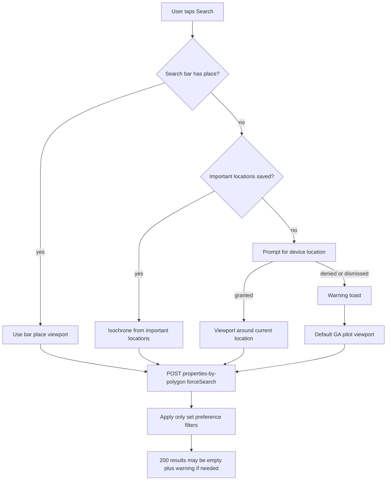

# Search area resolution

Search must **always run** when the user taps Search. Missing home preferences (budget, beds/baths, important locations) must not block execution. Preference filters apply only when the user has saved values (or explicit filter-sheet overrides).

Related: [profile-onboarding.md](../account/profile-onboarding.md) (settings no longer require home prefs).

## Upstream data providers (SIL-324)

| Concern | Provider | Notes |
|---------|----------|--------|
| Polygon listing search, property detail, images, comps | **RapidAPI** | Source of truth for listing/search results |
| Location bar area suggestions + area boundary polygons | **Slipstream** (HomeJunction) | Intentionally retained; Google Places remains a client fallback |

## Preference scoping (whose filters apply)

Whose preferences drive RapidAPI listing filters and scoring is determined by the **authenticated viewer** plus optional **`preferences_user_id`** on polygon/isochrone requests. The server resolves this through `resolve_preferences_user_id_for_research` (agents may only pass IDs in `client_ids`; buyers are always scoped to self).

| Flow | Client | `preferences_user_id` / subject | Server prefs source |
|------|--------|-----------------------------------|---------------------|
| Polygon force (isochrone) | `propertySearch.searchPropertiesInIsochrone` | Passed when agent has `selectedClientId` | `run_polygon_search` → `get_user_preferences_parsed(resolved_subject)` + merge body `user_preferences` overrides |
| Polygon force (viewport) | `propertySearch.searchPropertiesInViewport` | Same | Same |
| Polygon onlyCached | `fetchCachedPolygonSearchResults` | Optional `preferencesUserId` (buyers: typically omitted = self) | DB `UserPropertyLink` rows for **viewer only** (not subject-partitioned); agents skip initial fetch in `useSearchResultsData` |
| Isochrone GET | `searchApi.getIsochrone` query param | `preferencesUserId` when set | Same resolver + `get_user_preferences_parsed` |
| Property details / compare | `usePropertyDetails`, `usePropertyComparison` | `preferences_user_id` when agent + client | Research APIs |
| Session filter overrides | `searchContext.slice` | Merged into polygon body `user_preferences` | Server merges into subject prefs (`REQUEST_PREF_MERGE_KEYS` + must_have lists) |

`useAgentSyncPreferencesWhenClientSelected` copies the selected client’s saved preferences onto the **agent’s** profile row (filters UI). **Polygon and isochrone still must send `preferences_user_id`** when the UI subject is the client. Do not rely on sync alone for search correctness.

**Regression guards:** New callers of `searchByPolygon` / `getIsochrone` must pass `preferences_user_id` when acting on behalf of a selected client.

## Decision tree

## Location priority

| Search bar | Important locations | Area used |
|------------|---------------------|-----------|
| Has selected place | ignored | Bar place viewport/boundary |
| Empty | present | Commute isochrone union (or bounds overlay when commute off) |
| Empty | absent | Geolocation viewport; on deny → default Atlanta pilot market |

**Search bar wins** over saved important locations when `locationPlaceViewportRing` is set.

## Filter semantics

| Field | When unset in profile / overrides |
|-------|-----------------------------------|
| Budget min/max | No price filter |
| Beds / baths | No bed/bath filter |
| Must-haves / deal-breakers | Applied only when `preferences_strict_filter` is true |
| `preferences_strict_filter` | Opt-in; when true, must-haves are hard filters; when false, numeric filters still apply; empty results + warning, not HTTP failure |

Filter sheet slider defaults (e.g. 100k–2M) are display-only until the user moves them.

## Client implementation

Single resolver: `Client/packages/features/search/utils/searchArea/resolveSearchArea.ts`

- **Location bar:** `locationPlaceViewportRing` → `searchSource: 'location'`
- **Isochrone:** prefetched or fetched isochrone when `important_locations.length > 0`
- **Geolocation:** `requestDeviceLocationForSearch` (web `navigator.geolocation`; native stub returns `unavailable`)
- **Default market:** `defaultPilotSearchViewportRing()` — Atlanta metro centroid inside `SUPPORTED_SERVICE_AREA_BOUNDS`

All paths call `searchPropertiesInViewport` with a resolved `viewport_polygon`. Isochrone mode still sends geometry extracted from the isochrone feature so the server does not re-derive and 400.

Isochrone GET prefetch is gated: bootstrap route disabled; `useIsochroneData` requires `hasImportantLocations`.

## Server behavior

- **GET `/search/isochrone`:** Still returns 400 for empty/malformed locations (direct API misuse). Client avoids calling when locations are empty.
- **POST properties-by-polygon with `forceSearch`:** Accepts client `viewport_polygon`. If no geometry can be resolved, returns **200** with empty properties and `meta.searchArea: 'none'` (safety net).
- **`parse_important_locations`:** Normalizes `max_commute_minutes` → `commute_tolerance`.

## Platform notes

| Platform | Geolocation |
|----------|-------------|
| Web | Browser prompt via location bar or primary Search flow |
| Native | Resolver falls through to default market until Expo location is wired |
| Agent workspace | Uses selected client’s `preferences_user_id`; same resolver rules |

## Manual QA checklist

- [ ] No prefs, no locations, empty bar → geo prompt → deny → default market search runs (warning toast)
- [ ] Important locations only → isochrone search; commute overlay when enabled
- [ ] Bar place selected → bar area; important locations ignored
- [ ] Missing beds/baths/budget in profile → search returns results without those filters
- [ ] Settings save with empty budget, beds/baths, and `important_locations: []` → succeeds
- [ ] Agent viewing client with no locations → geo/default path, not hard stop
- [ ] `preferences_strict_filter` on → may return empty set with warning, not 400
