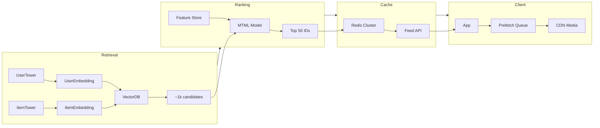
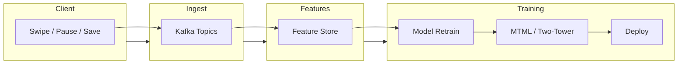
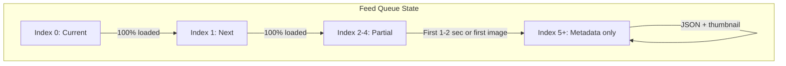

# Reels: Architecture and Data Flow

## Full production flow



## Event feedback loop



## Client prefetch state machine



## Data flow: User opens app

1. **Feed request** — Client calls Feed API with `user_id` (from auth).
2. **Cache read** — API reads Redis key `feed:{user_id}` and returns pre-ranked list of listing IDs (and metadata if stored).
3. **Media URLs** — Response includes CDN URLs for thumbnails and media; client requests them from CDN.
4. **Prefetch** — While user views index 0, client prefetches index 1 fully and index 2–4 partially (first image or first seconds of video).
5. **Swipe** — User swipes; index 1 is already in memory and plays immediately.

## Ranking formula (target)

Expected Value (EV) drives the order of the feed:

```
EV = w1 * P(save) + w2 * P(contact_agent) + w3 * P(share) + w4 * P(book_tour)
```

- **Weights (w1–w4)** are tunable (e.g. increase w2 when agent leads are the priority).
- **P(...)** are outputs from the MTML model for each home.
- Homes are sorted by EV descending; top N go into the Redis queue.

See [02-tech-stack-and-rationale](./02-tech-stack-and-rationale.md) for the role of each component.
