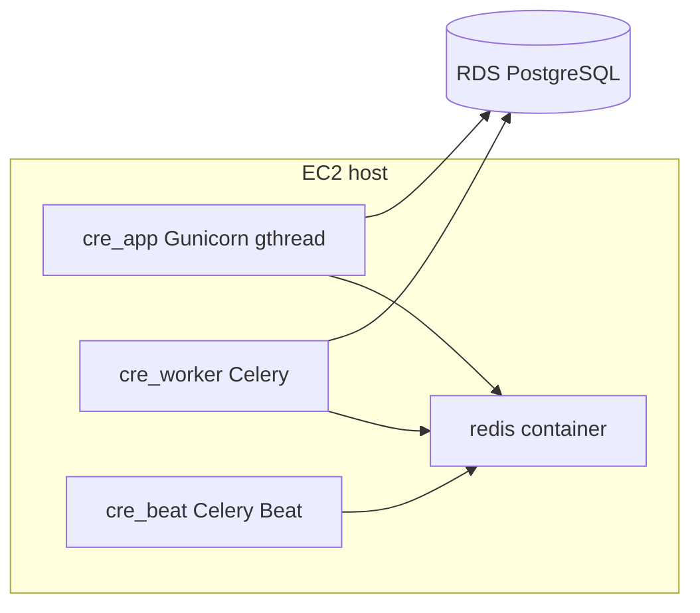

# Scaling playbook

Operational guide for SilverKey backend capacity: current topology, tuning knobs, and prerequisites for horizontal scale. Product behavior is unchanged — this documents runtime configuration only.

## Current topology (single EC2)



**Canonical deploy:** [`.github/scripts/ec2-deploy.sh`](../../../.github/scripts/ec2-deploy.sh) (invoked from [`.github/workflows/ci_web.yml`](../../../.github/workflows/ci_web.yml) on the EC2 host).

Containers:

| Container | Role |
|-----------|------|
| `cre_app` | Flask + Gunicorn (`Server/scripts/gunicorn-entrypoint.sh`) |
| `cre_worker` | Celery worker (`default`, `heavy`, `docusign` queues) |
| `cre_beat` | Celery Beat (daily weight training schedule) |
| `cre_worker_heavy` | Optional (`DEPLOY_HEAVY_WORKER=true`) — `-Q heavy` only |
| `redis` | Broker, results, messaging pub/sub, rate limits |

## What breaks first under load

1. **Gunicorn thread pool** — long SSE streams and heavy polygon search consume threads (mitigated by `gthread` + `GUNICORN_THREADS`).
2. **Celery queue depth** — research, home matching, and DocuSign tasks share worker capacity; enable `cre_worker_heavy` or add workers for isolation.
3. **RDS connections** — tune pools before adding app workers (see below).
4. **Container Redis** — single point of failure; migrate to ElastiCache when scaling beyond one host.

## Environment variables

### Gunicorn (app container)

| Variable | Default | Notes |
|----------|---------|-------|
| `WEB_CONCURRENCY` | `4` | Worker processes |
| `GUNICORN_THREADS` | `8` | Threads per worker (`gthread`) |
| `GUNICORN_TIMEOUT` | `3600` | Long SSE / research streams |
| `GUNICORN_MAX_REQUESTS` | `1000` | Worker recycle (+ jitter) |
| `GUNICORN_WORKER_CLASS` | `gthread` | Use `sync` only for debugging |

Effective HTTP concurrency ≈ `WEB_CONCURRENCY × GUNICORN_THREADS` (default **32**).

### Database pool (app + Celery)

| Variable | Default | Notes |
|----------|---------|-------|
| `DB_POOL_SIZE` | `5` | Per process |
| `DB_MAX_OVERFLOW` | `10` | Burst connections per process |

**Formula:** `(WEB_CONCURRENCY × (DB_POOL_SIZE + DB_MAX_OVERFLOW)) + celery_headroom ≤ RDS_max_connections − 15`

Example with defaults on `db.t3.medium` (~87 connections): 4 × 15 = 60 app + ~15 Celery ≈ **75** — leaves headroom.

### Celery

| Variable | Default (Linux prod) | Notes |
|----------|----------------------|-------|
| `CELERY_CONCURRENCY` | `4` | Worker parallelism |
| `CELERY_WORKER_POOL` | `prefork` | `threads` on macOS dev |
| `DEPLOY_HEAVY_WORKER` | `false` | Second container for `-Q heavy` |

### Proxy / telemetry

| Variable | Default (EC2) | Notes |
|----------|---------------|-------|
| `TRUST_PROXY_HEADERS` | `true` | Enables `ProxyFix` for ALB-ready client IP |
| `DEPLOY_IMAGE_TAG` | git SHA from deploy | PostHog `api_request.deploy_image_tag` |

## Manual scale steps (today)

No auto-scaling in repo yet. Operators can:

1. **Resize EC2** — more CPU/RAM for Gunicorn + Celery + embedding workloads.
2. **Tune env vars** — increase `WEB_CONCURRENCY` / `GUNICORN_THREADS` or `CELERY_CONCURRENCY` after verifying RDS connection headroom.
3. **Enable heavy worker** — set `DEPLOY_HEAVY_WORKER=true` on deploy host before running `ec2-deploy.sh`.
4. **Run load smoke** — [`scripts/load/README.md`](../../scripts/load/README.md) against staging or [`scripts/deploy/prod-parity/`](../../../scripts/deploy/prod-parity/) compose.

## Multi-instance prerequisites (future)

Before placing an ALB in front of multiple app containers:

- [ ] **Redis-backed rate limits** — implemented (`REDIS_URL` required).
- [ ] **`TRUST_PROXY_HEADERS=true`** — client IP for rate limiting behind ALB.
- [ ] **Messaging SSE** — Redis pub/sub fan-out (see [`documentation/runbooks/messaging-sse-operations.md`](./messaging-sse-operations.md)).
- [ ] **Managed Redis** — replace container Redis; update `REDIS_URL` / `CELERY_URL`.
- [ ] **Proxy SSE settings** — disable buffering, long read timeout (nginx/ALB).
- [ ] **Shared nothing** — uploads go to S3; no local disk session store.

## Local prod-parity testing

```bash
make prod-parity-build
make prod-parity
# or automated gate: make prod-parity-smoke
curl -s http://127.0.0.1:5000/readyz | jq .
```

Requires populated `Server/.env` (including `DATABASE_URL`).

## Observability

PostHog HogQL templates: [posthog-capacity-queries.md](./posthog/capacity-queries.md).

## Related

- [redis-celery.md](./redis-celery.md)
- [deployment.md](../guides/deployment.md)
- [infrastructure-reliability-gap-audit.md](../guides/deployment.md)
