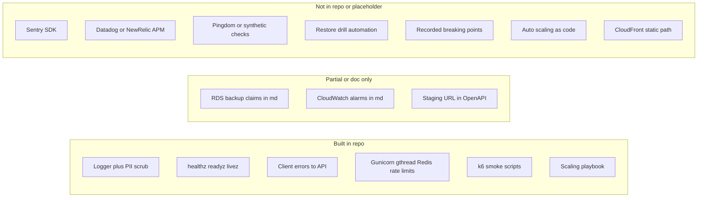

# Infrastructure reliability checklist (repo audit)

A point-in-time audit of the SilverKey repository against a standard infrastructure and reliability checklist: what is implemented in code or clearly wired, what exists only as documentation or AWS account configuration outside git, and what is missing or placeholder.

**Scope:** This document reflects what is **verifiable from the repository and deploy scripts**. Anything configured only in the AWS console (backups, alarms, external monitors) is **not** provable from git and is called out as such. For evidence of live AWS config, use the account console or Infrastructure-as-Code where it lives.

## Strong match (implemented in repo)

- **Logging with PII scrubbing** — **Built.** Centralized loggers and scrubbers on both [`Client/packages/logger`](../../Client/packages/logger) (e.g. `pii.ts`) and [`Server/logger`](../../Server/logger) (e.g. `pii.py`); rules in [`.cursor/rules/shared/logging.mdc`](../../.cursor/rules/shared/logging.mdc). Server client-error ingestion also limits keys and size in [`Server/app/routes/client_errors.py`](../../Server/app/routes/client_errors.py).
- **Health / liveness endpoint** — **Built.** `GET` `/healthz`, `/readyz` (DB + Redis), `/livez` (process only) in [`Server/app/http/flask_runtime_routes.py`](../../Server/app/http/flask_runtime_routes.py); used in deploy healthchecks in [`.github/scripts/ec2-deploy.sh`](../../.github/scripts/ec2-deploy.sh).
- **Scale-readiness (runtime)** — **Built in repo.** Env-driven Gunicorn (`gthread`), Redis-backed rate limits, Celery Beat deploy, task queues, DB pool env vars, PostHog capacity properties, k6 smoke harness — see [`ops/scaling-playbook.md`](./ops/scaling-playbook.md).
- **Load test harness (smoke)** — **Built.** [`scripts/load/`](../../scripts/load/) k6 scripts; baseline template in README (no CI gate on prod).
- **Scaling playbook** — **Built.** [`ops/scaling-playbook.md`](./ops/scaling-playbook.md) documents tuning and multi-instance prerequisites (AWS automation still out of repo).
- **Some operational documentation** — **Exists**, e.g. disaster-recovery notes in [`aws-resources.md`](./aws-resources.md), rollback *ideas* in [`openapi-validation-rollout.md`](./openapi-validation-rollout.md) (e.g. flip `OPENAPI_VALIDATION_MODE` and restart).

## Partial or “documentation only”

- **Automated DB backups** — **Documented, not implementable in app code.** [`aws-resources.md`](./aws-resources.md) states RDS automated daily backups and retention. **No Terraform** (`.tf`) in this repository, so backup policy is **not defined as code here.**
- **Tested restore procedures** — **Not evidenced in repo.** The same doc states RTO/RPO and snapshot restore in prose; there are **no** restore drill scripts, scheduled restore tests, or runbooks that prove periodic validation. The bar “untested backups don’t count” is **not satisfied** by anything in this repository.
- **Monitoring and alerting (Sentry, Datadog/New Relic, Pingdom-style uptime)**:
  - **Sentry (errors)** — **Not built.** [`Client/packages/services/security/errorReporter/ErrorReporterClass.ts`](../../Client/packages/services/security/errorReporter/ErrorReporterClass.ts) calls `initializeSentry` a **“placeholder”**; it only logs. The `@sentry` SDK is not present in the client dependency set used for this audit. “External” reporting is `sendToExternalService` → `clientErrorsApi` (your API), not Sentry. **No Sentry in Server** (no `sentry` / `datadog` / `newrelic` in `Server/requirements/runtime.txt` for this purpose).
  - **APM (Datadog / New Relic)** — **Not built** in app; client logging uses `packages/logger` (PostHog sink when configured). External APM integration is not wired in production paths today.
  - **CloudWatch / alarms in docs** — [`aws-resources.md`](./aws-resources.md) lists log groups and alarms, but that is **not** wired in this repository; treat as **target or external** unless confirmed in AWS.
  - **Uptime / synthetic monitoring (e.g. Pingdom)** — **Not present** in repo (no check definitions, no integration code). May exist outside the repository; **not** verifiable from git.
- **Staging that mirrors production** — **Partially improved.** [`scripts/deploy/prod-parity/docker-compose.yml`](../../scripts/deploy/prod-parity/docker-compose.yml) provides local app+redis+worker+beat parity; no second AWS stack in CI.
- **Rollback plan for deployments** — **Partially improved in repo.** Prod deploy (`.github/workflows/ci_web.yml`) uses immutable **git-SHA tags** and **digest-pinned** pulls; EC2 captures a local `cre-rollback:predeploy-*` image before pull and attempts automatic rollback on failure (see `.github/scripts/ec2-deploy.sh`). There is still **no** blue/green or “deploy previous N from ECR” button in CI; recovery from a half-failed migration may require DB inspection (`alembic_version`). [openapi-adoption-checklist.md](../dev/cursor-legacy/openapi-adoption-checklist.md) may still list “Rollback procedure tested” as unchecked until ops validates end-to-end.
- **CDN for static assets** — **Not clearly built as a CDN in the deploy path.** Front-end is **synced to `/var/www/html` on the EC2 host** during [`.github/scripts/ec2-deploy.sh`](../../.github/scripts/ec2-deploy.sh) (invoked from `ci_web`). Product docs (e.g. [`documentation/reels/04-current-infrastructure.md`](../reels/04-current-infrastructure.md)) list **“CDN + video optimizations”** as a **gap** vs “standard HTTP delivery.” [`aws-resources.md`](./aws-resources.md) mentions deploying to a “CDN bucket” in CI user permissions, but the **active** `ci_web` path is EC2 + tar extract, not a CloudFront+S3 static pipeline defined in this repository.

## Not built (or not present in repository)

- **End-to-end error monitoring with Sentry** (SDK + DSN + releases) — **Not built.**
- **Full-stack APM (Datadog, New Relic, or similar)** — **Not built** in code.
- **External uptime / SLO-style synthetic monitoring** — **Not in repo.**
- **Proven, repeatable DB restore test** (automation or scheduled drill) — **Not in repo.**
- **Recorded breaking-point load results** — **Not in repo** (k6 smoke harness exists; operators fill baseline template locally).
- **Auto-scaling as code (ASG/ECS)** — **Not in repo.** Manual scale steps and env tuning documented in [`ops/scaling-playbook.md`](./ops/scaling-playbook.md).

## Diagram (summary)

## Summary table

| Item | Verdict from this repo |
|------|------------------------|
| Automated DB backups | Relying on AWS; described in docs, not as code; restore testing not in repo |
| Tested restore | Not built / not evidenced |
| Sentry for errors | Not built (placeholder + API logging only) |
| Datadog / New Relic | Not built |
| Uptime (Pingdom-like) | Not in repo |
| Staging mirroring prod | Partially referenced; parity not provable from repo |
| Proper logging, PII scrubbed | Built |
| Load tests / breaking points | Smoke harness in repo; recorded baselines operator-owned |
| Auto-scaling or clear playbook in repo | Playbook + env tuning built; ASG/ECS not in repo |
| CDN for static assets | Not the current, scripted deploy path; still a doc gap |
| Rollback for deployments | Ad hoc; not automated or checklist-complete in repo |

**Note:** If you need **evidence** for items that *might* exist only in AWS (backups, alarms, CloudWatch, external monitors), that requires **account/console** review. Re-run or extend this audit when Infrastructure-as-Code, monitoring, or deploy workflows change.
