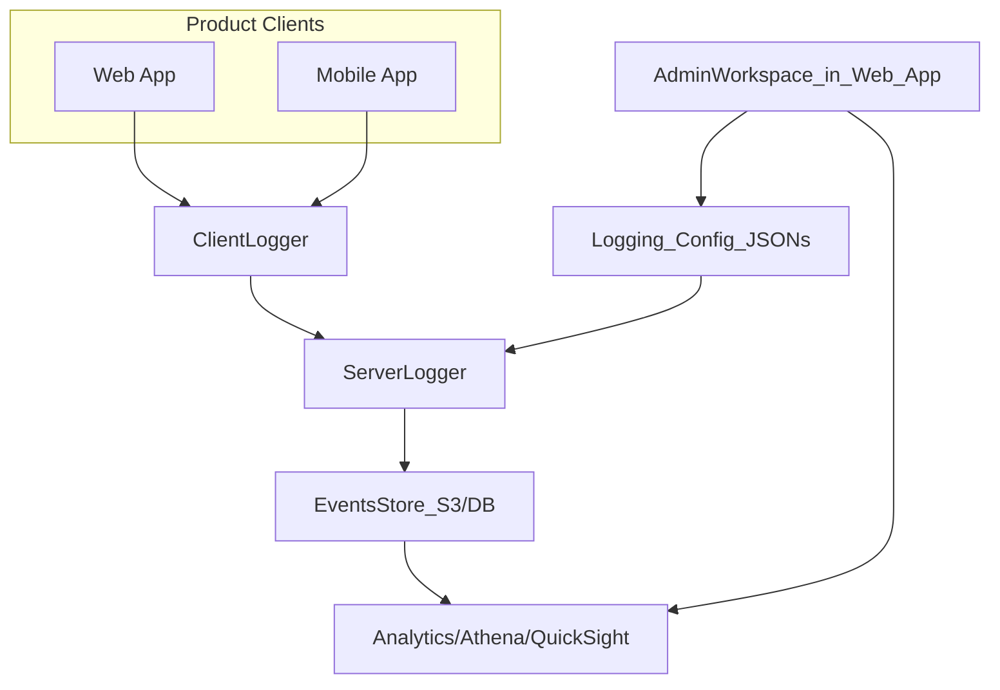

# Admin Workspace: Technology Options & Architecture

This document compares implementation options for the admin workspace using the existing stack and AWS, and recommends an approach for v1.

## Option 1 – Secured section in existing web app

**Idea:** Add an admin area inside `Client/apps/web`: dedicated routes (e.g. `/admin`, `/admin/logging`, `/admin/metrics`), same auth and UI kit, role-gated so only admins see it.

**How it works**

- New pages/screens under the web app that:
  - Check user role (or equivalent) before rendering; redirect or 403 if not admin.
  - Call backend APIs to read/write logging config and to fetch aggregated metrics.
- Backend: thin API layer that:
  - Reads/writes logging config (from repo, S3, or parameter store – see logging-config doc).
  - Queries the analytics store (DB or Athena) for metrics, or returns links/embed info for QuickSight.
- Reuse existing: auth, routing, UI components, React Query, logger.

**Pros**

- Fastest to ship; no new app to deploy or maintain.
- Single codebase and shared auth; no cross-app SSO or duplicate UI.
- Fits thin-app architecture: admin is just another composed surface in the web app.

**Cons**

- Admin and product app share the same deployment; a bad deploy affects both (mitigated by feature flags and testing).
- Less physical isolation than a separate app (acceptable for internal tooling).

## Option 2 – Separate admin app

**Idea:** New app, e.g. `Client/apps/admin` (or a separate repo), with its own build and deploy, used only by admins.

**How it works**

- Standalone SPA that authenticates against the same auth backend (or an admin-specific endpoint).
- Has its own routes, pages, and API client; can still call the same backend APIs for config and metrics.
- Deployed to a separate URL (e.g. `admin.silverkey.com` or path on same domain with strict access control).

**Pros**

- Clear separation: admin tooling can evolve independently and with different release cadence.
- Smaller bundle for the main product app; admin code is never loaded by end users.

**Cons**

- More to maintain: two apps, possibly two deploy pipelines.
- Need to ensure auth and permissions stay in sync (shared roles/permissions model).

## Option 3 – Minimal custom UI + AWS console tools

**Idea:** Use AWS-native tools (e.g. QuickSight for dashboards, Parameter Store or S3 for config) and build only a very small “launcher” or internal wiki that links to them and documents how to change config.

**How it works**

- Logging config: edit JSON in S3 or Parameter Store via AWS console or CLI; document the schema and process.
- Metrics: use QuickSight (or similar) directly; no custom React dashboards.
- Optional: tiny internal page that lists “links to config bucket”, “link to QuickSight folder”, and any one-off scripts.

**Pros**

- Minimal custom code; leverages AWS tooling.
- Good if the team is small and comfortable in the AWS console.

**Cons**

- Weaker UX for “change config and see effect” without a dedicated editor and validation.
- No unified audit trail in our app; audit is in CloudTrail / QuickSight access logs.
- Less aligned with “single admin workspace” product vision.

## Recommendation for v1

**Recommended: Option 1 – Secured section in existing web app.**

- Reuse `Client/apps/web` and existing backend; add `/admin` routes and role checks.
- Implement logging config editor and metrics overview/drill-down as specified in the user-flows doc.
- Prefer existing stack (React, React Query, shared UI, backend APIs); use QuickSight or Athena only where embedding or linking adds value (e.g. heavy ad-hoc analytics).

If later we need stricter isolation or a different release cycle for admin tooling, we can extract the admin section into Option 2 without changing the backend API contract.

## High-level architecture

- **Product clients** (web + mobile) emit events via existing loggers; backend and/or pipeline persist to EventsStore (S3/DB) and feed Analytics (Athena/QuickSight).
- **Admin workspace** lives inside the web app: it reads/writes **Logging_Config_JSONs** (source of truth as per logging-config doc) and reads **Analytics** (aggregated metrics or links to QuickSight).
- **Config** is consumed by Backend (and optionally client via API or build-time injection) so that logger behavior is consistent.

This keeps the admin workspace on the existing stack and AWS, with a clear path to Option 2 or deeper QuickSight integration later.
