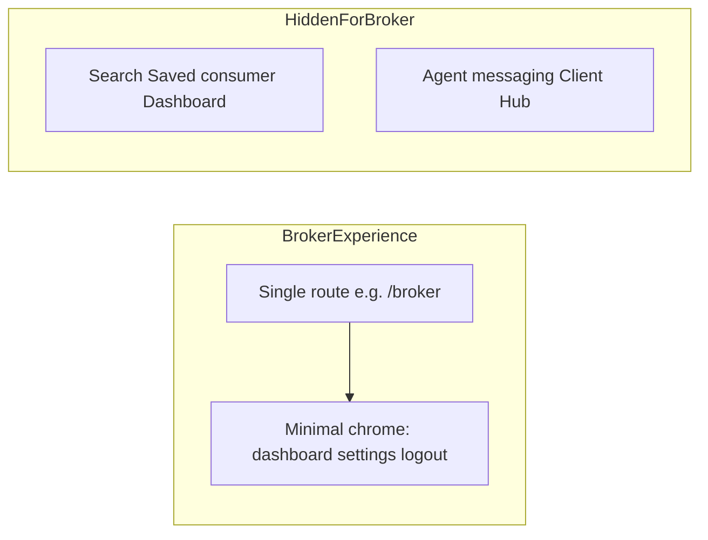

# Broker team dashboard: scope, experience, and implementation notes

This document defines a future **broker / office-lead experience** in SilverKey: a **single read-heavy dashboard** that shows how **agents on the team** are doing, without exposing the normal buyer or agent app surfaces (search, saved homes, consumer dashboard, agent client hub, messaging, etc.).

It is written in the same spirit as the **agent vs buyer experience** split documented for engineering ([user-type-agent-experience.mdc](../../../.cursor/rules/shared/user-type-agent-experience.mdc)): a distinct persona gets a distinct route bundle, nav, and data scope.

## Current state vs this spec

Today:

- **Buyer vs agent** UX is driven by `User.roles` (including `agent`) and helpers like `useIsAgent()`; see the rule linked above.
- **Roles** (`UserRole` in [`Client/packages/config/auth/auth.ts`](../../../Client/packages/config/auth/auth.ts)) are `user`, `agent`, `admin`, `super_admin`. There is **no broker / office-manager role**.
- **Brokerage** appears as **agent profile fields** (e.g. `agent_brokerage_name`, address, contact) — useful for display and compliance, **not** for “this user supervises these agents.”

This spec assumes we will **introduce a broker persona** (exact mechanism below) and **ship one primary UI surface** scoped to **their organization’s agents**.

## Purpose

- Give a **broker or office lead** a **glanceable team overview**: who is active, how many clients or deals they are carrying, and simple health signals (examples below — product can tune KPIs).
- Keep the experience **narrow**: one dashboard job-to-be-done, not a second full product.

## Primary users

- **Broker of record / managing broker** — oversight across licensed agents affiliated with the same brokerage or org.
- **Office admin / team lead** (optional) — same UI if product assigns them the same role and scope.

## Non-goals (v1)

- **Not** a full CRM or transaction system for brokers.
- **Not** impersonation: the broker does not “log in as” an agent to edit clients unless a separate, explicitly scoped feature is added later.
- **Not** parity with the **agent** messaging or **Client Hub** flows; brokers use **aggregates and rollups**, not the same per-client screens agents use.
- **Not** consumer search, saved homes, or onboarding flows meant for buyers.

## Experience model (parallel to agent vs buyer)

### Third experience slice

| Persona   | Typical intent              | Today (approx.)                          |
|----------|-----------------------------|------------------------------------------|
| Buyer    | Own home search & workflow  | Search, Saved, Dashboard, Profile, …     |
| Agent    | Serve clients               | Messaging + client tooling when user has `agent` role |
| **Broker** | **Oversee team performance** | **Not implemented — this doc**           |

### Single primary surface

- **One route** hosts the entire v1 experience (working name: `/broker` or `/team` — pick one convention when implementing and keep web/mobile route schema aligned per [web-mobile-parity-gotchas.md](../../client/platform/web-mobile-parity-gotchas.md)).
- **Deep links** to other app areas are **out of scope for v1** unless required for legal/support; default is **land on dashboard, stay in dashboard**.

### Navigation: hide regular app pages

For users in the broker experience:

- **Do not show** primary nav entries for: Search, Saved, consumer **Dashboard**, **Messaging**, Agent **Client Hub**, Reels (if present), and other standard app tabs.
- **Minimal chrome** is enough for v1, for example:
  - **Team dashboard** (the main page).
  - **Profile / Settings** (so account, password, org affiliation can be maintained).
  - **Logout**.

If brokers must accept terms or manage org billing later, add explicit flows rather than exposing the full app map.

### Relationship to the agent role

- A broker user might or might not also be a licensed agent in real life; **product should decide** whether broker accounts omit the `agent` role only, or allow dual-hat.
- **UX rule:** when the user is in **broker mode** (role-gated), render **only** the broker shell + dashboard, **not** the agent client workspace — even if they also have the `agent` role. Prefer **role + route** for authorization and layout, not `useIsAgent()` alone.

## Identity and authorization (design for implementation)

**Requirement:** Any team or client data a broker sees must be **scoped server-side** to **their brokerage / org** (or explicit allow-list). UI hiding nav is not sufficient.

### Options to compare (v1 recommendation: pick one and document in ADR when building)

1. **`UserRole.BROKER` (or `OFFICE_ADMIN`)** plus dedicated permissions (e.g. `VIEW_TEAM_AGENTS`, `VIEW_TEAM_METRICS`) in [`ROLE_PERMISSIONS`](../../../Client/packages/config/auth/auth.ts) — symmetric with admin role modeling.
2. **Profile flag** `is_broker` (or `can_view_team_dashboard`) **plus** a stable **org/brokerage id** on the user record — good if many brokers are not “agents” in product terms.
3. **Brokerage-scoped admin** — reuse admin tooling patterns but with **row-level scope** so the user is not global `ADMIN`.

**Implementation pointers:**

- Use **RoleGuard** (or equivalent) and **server-side checks** on every API that returns team or aggregate data: [`RoleGuard.tsx`](../../../Client/apps/web/app/guards/RoleGuard.tsx).
- Keep the distinction from [user-type-agent-experience.mdc](../../../.cursor/rules/shared/user-type-agent-experience.mdc): **`roles` for access** (including `agent` for agent product UX) — broker access should be **role-based**, not inferred from brokerage name on someone else’s profile.

### Org membership

- **Define** how agents belong to a brokerage: shared `brokerage_id`, invitation graph, or external IdP groups. The dashboard APIs must resolve “agents under this broker” from that source of truth, not from string matching on `agent_brokerage_name`.

## Main screen (sketch)

High-level sections only (no pixel spec); style similar to [Admin workspace: user flows & feature list](../admin-workspace/02-user-flows-and-feature-list.md).

| Area | Intent |
|------|--------|
| **Header / filters** | Time range (e.g. 7 / 30 / 90 days), optional team segment if product supports teams-within-brokerage. |
| **Org summary** | Total agents, active agents, total connected clients (counts), optional funnel snapshot. |
| **Team table or cards** | One row per agent: name + internal id, last active, client count, optional deal/checklist counts, status badge (e.g. active / stale). |
| **Alerts** | Configurable thresholds (e.g. no logins in N days, zero active clients) — v1 can be a simple list. |
| **Drill-down (optional v1)** | Click agent → **read-only** detail panel with **aggregates** only; avoid full client PII unless explicitly approved in privacy review. |

## Data and APIs

### Likely inputs (existing product concepts)

- **Agent roster** for the org — from authoritative user/org tables, not from scraping profile text fields.
- **Per-agent activity** — logins, sessions, or feature usage consistent with [user-activity-observability/04-metrics-and-insights.md](../user-activity-observability/04-metrics-and-insights.md).
- **Client counts** — number of assigned or connected clients per agent (aggregates).
- **Optional later** — checklist completion rates, calendar density, document pipeline — only if definitions match agent-facing semantics.

### Net-new work

- **Broker-scoped read APIs** that return **aggregates and internal IDs** only by default.
- **Pre-aggregation or materialized rollups** if real-time joins are too heavy (same performance mindset as [admin-workspace/05-analytics-and-dashboards.md](../admin-workspace/05-analytics-and-dashboards.md)).

## Security and privacy

Align with [user-activity-observability/05-privacy-and-governance.md](../user-activity-observability/05-privacy-and-governance.md):

- **No raw PII** in dashboard widgets by default (no client emails, phones, message bodies, or free-text notes).
- Use **internal user ids**, **counts**, and **coarse dimensions** brokers are allowed to see under policy.
- **Audit** broker access to sensitive drill-downs if product expands beyond aggregates.

## Summary

- Add a **broker persona** with **server-scoped** access to **their org’s agents**.
- Ship **one primary dashboard route** and **hide** standard buyer and agent nav.
- Prefer **roles + route** for layout and auth; do not rely on `useIsAgent()` alone or profile strings alone.
- Metrics should mirror **observability and admin** norms: **trustworthy definitions**, **aggregates**, **no unnecessary PII**.

## Cross-links

| Topic | Where |
|-------|--------|
| Agent vs buyer experience | [`.cursor/rules/shared/user-type-agent-experience.mdc`](../../../.cursor/rules/shared/user-type-agent-experience.mdc) |
| Admin analytics / dashboards | [../admin-workspace/05-analytics-and-dashboards.md](../admin-workspace/05-analytics-and-dashboards.md) |
| Metrics definitions | [../user-activity-observability/04-metrics-and-insights.md](../user-activity-observability/04-metrics-and-insights.md) |
| Privacy & governance | [../user-activity-observability/05-privacy-and-governance.md](../user-activity-observability/05-privacy-and-governance.md) |
| How we add or split docs | [../../HOW_WE_DOCUMENT.md](../../HOW_WE_DOCUMENT.md) |
