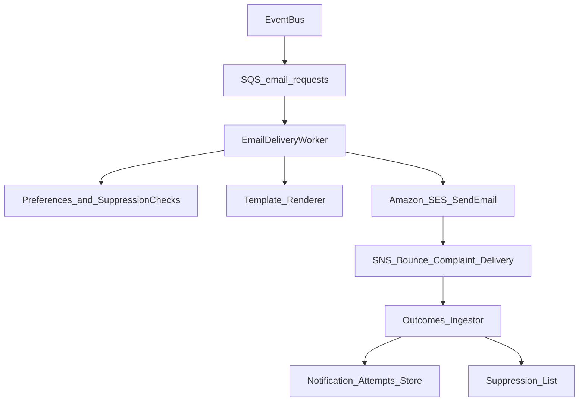

# Delivery system: Email (AWS SES)

This doc defines the email delivery design using **Amazon SES** for transactional email, with AWS-native eventing, suppression, and observability.

## High-level flow

## SES setup (implementation-ready)

### Domain authentication (required)

Configure email authentication before sending at scale:

- **SPF**: authorize SES to send on behalf of your domain
- **DKIM**: cryptographic signing for deliverability
- **DMARC**: policy + reporting (start with `p=none`, then move toward `quarantine` / `reject`)

### Configuration sets (recommended)

Use SES Configuration Sets to attach:

- event destinations (SNS) for bounce/complaint/delivery
- tagging (tenantId, notificationType) for analytics

## Data model (minimum)

- **`notification_attempts`**
  - `idempotencyKey` (unique)
  - `userId`
  - `channel` = `email`
  - `toEmail` (encrypted-at-rest)
  - `notificationType`
  - `templateId`
  - `subject`
  - `status` (queued/sent/delivered/failed/suppressed/unsubscribed/complained/bounced)
  - `providerMessageId`
  - timestamps

## Templates and rendering

Two common approaches:

- **SES templates** (simple, AWS-hosted): good for small sets of transactional templates.
- **App-rendered HTML** (recommended for flexibility): render in your worker using a vetted template engine and send via SES.

Template design guidelines:
- Keep templates transactional unless a marketing system is introduced later.
- Localize using upstream `locale` and render in the worker.
- Prefer server-side deep links (redirect endpoints) instead of embedding raw app URLs everywhere.

## Unsubscribe and preferences

Email compliance requirements depend on type:

- **Transactional** email often does not require a marketing unsubscribe, but users should still be able to mute certain notification types.
- **Marketing** email requires clear unsubscribe and must honor it quickly.

Recommended implementation:
- Include an **Email Preferences** link for all non-security emails.
- For marketing-style messages, include a one-click unsubscribe token.
- Maintain a suppression list keyed by (email, tenant) with reason (unsubscribed/complained/bounced).

## Bounce and complaint handling (must-have)

Wire SES events to SNS, then ingest into the outcomes pipeline:

- **Bounces**: mark address as suppressed (hard bounce) and stop sending.
- **Complaints**: suppress immediately; treat as high-severity compliance signal.

If you use SES account-level suppression lists, keep them in sync with your app-level preferences so your UI can reflect reality.

## Retries and failure classes

- Retry transient failures (throttling, temporary provider issues).
- Do not retry:
  - suppressed/unsubscribed
  - permanently invalid email addresses (after hard bounce)

Use an SQS DLQ for repeated failures and alert on critical notification types.

## Security notes

- Treat emails as PII: encrypt at rest, never log raw email addresses.
- Do not embed secrets in email links; use short-lived tokens and server-side redirects.
- Sign and validate any inbound webhook/callback traffic (SNS signatures).

## MVP checklist

- [ ] SES domain verification + DKIM/SPF/DMARC baseline
- [ ] Worker can render templates and send through SES
- [ ] SNS → outcomes ingestion for bounce/complaint/delivery
- [ ] Suppression list + preferences integration
- [ ] Idempotency enforcement per `idempotencyKey`
