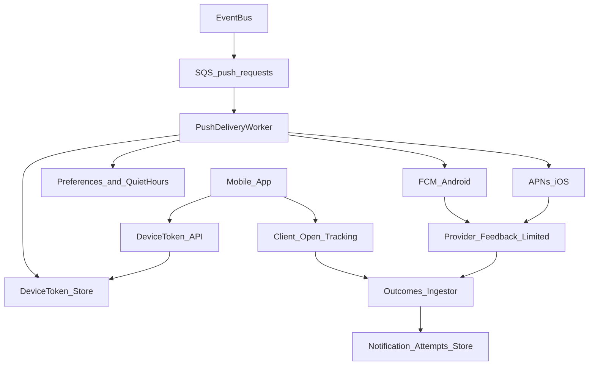

# Delivery system: Mobile push (iOS + Android)

This doc defines the push delivery design for iOS (APNs) and Android (FCM), including device token lifecycle, payload constraints, and tracking strategy.

## Recommended AWS-first setup

**Default**: Deliver push directly via **APNs** (iOS) and **FCM** (Android), orchestrated by AWS (EventBridge/SQS/workers).

**Alternative**: Amazon Pinpoint can send push, but direct APNs/FCM is typically simpler to operate when you want full control over payloads, deep links, collapse keys, and multi-environment credentialing.

## High-level flow

## Device token lifecycle (must-have)

### Token registration

Mobile apps must register tokens with your backend:
- iOS: APNs device token
- Android: FCM registration token

Recommended API shape:
- `POST /v1/devices/tokens`
  - `platform`: `ios` | `android`
  - `token`: string
  - `appVersion`, `deviceModel`, `osVersion` (optional but useful)
  - `environment`: `dev` | `staging` | `prod`

### Token refresh + invalidation

- Tokens can rotate; app should re-register on refresh.
- Provider responses can indicate invalid tokens:
  - APNs: 410 / “Unregistered” (or token invalid)
  - FCM: “NotRegistered” / “InvalidRegistration”

On invalidation, mark the token as inactive and stop using it.

## Data model (minimum)

### `device_tokens`
- `deviceTokenId`
- `userId`
- `platform` (`ios`/`android`)
- `environment` (`dev`/`staging`/`prod`)
- `token` (encrypted-at-rest)
- `isActive`
- `lastRegisteredAt`
- `lastSuccessAt` (optional)
- device metadata fields (optional)

### `notification_attempts` (push)
- `idempotencyKey` (unique)
- `userId`
- `channel` = `push`
- `platformTarget` = `ios`/`android`/`both`
- `notificationType`
- `status` (queued/sent/failed/suppressed)
- `providerMessageId` (FCM message id; APNs apns-id if available)
- timestamps

## Credentials and environment separation

### iOS (APNs)

Use **APNs Auth Key (.p8)** with `teamId` + `keyId` (recommended over certificates).

Keep separate credentials for:
- dev/staging (sandbox)
- production

Store credentials in a secret manager (e.g., AWS Secrets Manager) and load them only in the push worker.

### Android (FCM)

Use a Firebase project per environment (or at least separate server keys/service accounts per env).

Store credentials in Secrets Manager; restrict IAM access to push workers only.

## Payload design

### Contract

Push payloads should be based on a stable internal contract:
- `notificationType`
- `title`
- `body`
- `deepLink` (or route name + params)
- `collapseKey` / `threadId` (for collapsing repeated notifications)
- `priority` (high/normal)

### iOS notes (APNs)

- Prefer **notification + data** payloads for user-visible alerts.
- Use `apns-collapse-id` for collapsing.
- Use `apns-push-type` correctly (`alert` for user-visible).
- Keep payload size constraints in mind (APNs payload has tight limits).

### Android notes (FCM)

- Decide between `notification` vs `data` messages:
  - `notification` integrates with system UI but is less flexible.
  - `data` gives full control but requires app handling for display depending on state.
- Use `collapse_key` and TTL for dedupe/delivery semantics.

## Quiet hours, throttling, and batching

- **Quiet hours**: respect user timezone from upstream envelope.
- **Priority rules**:
  - security/urgent reminders: high priority and bypass quiet hours only with explicit policy
  - engagement: normal priority, can batch/digest
- **Rate limiting** per tenant and per notification type.

## Delivery and open tracking

Push providers generally do **not** give reliable “delivered/opened” signals across platforms.

Recommended approach:

- Track **send attempt** (server-side) when APNs/FCM accept the request.
- Track **open** (client-side) by emitting an “opened” event when the app receives/taps the push and navigates.

Client-side open event should include:
- `notificationAttemptId` (or `idempotencyKey`)
- `openedAt`
- app/device metadata (optional)

## Deep links and navigation

Use a server-controlled deep link strategy:
- Push contains a stable `deepLink` or route identifier.
- App routes internally based on a shared route schema.

Avoid embedding sensitive identifiers directly; prefer short-lived redirect tokens for security-sensitive navigation.

## Fallback policies (optional, transactional only)

If a push is critical (e.g., time-sensitive reminder), you may define policies like:
- If no open within N minutes → send email
- If push fails due to missing tokens → send email

Implement fallback in the orchestrator as a policy layer (not in product services).

## MVP checklist

- [ ] Token registration endpoint + encrypted storage
- [ ] Push worker that can send to APNs + FCM with env separation
- [ ] Invalid-token handling and cleanup
- [ ] Payload contract including deep links + collapse keys
- [ ] Client-side open tracking into outcomes pipeline
