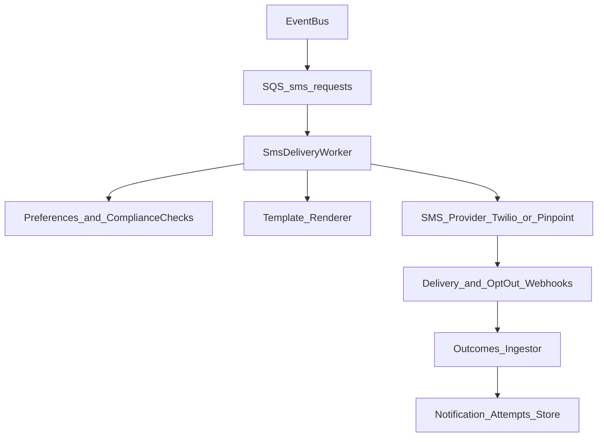

# Delivery system: SMS

This doc defines the SMS delivery design: provider choice, compliance primitives, and the worker flow from the notifications orchestrator.

## Recommended AWS-first setup

**Default**: Use **Twilio** for SMS delivery initially, with AWS handling orchestration and durability.

Rationale (typical in production):
- Twilio has strong global deliverability, tooling, and clear opt-out handling.
- AWS still provides the backbone (EventBridge/SQS/workers, auditing, preferences).

**Alternative**: **Amazon Pinpoint SMS** can be used when you want deeper AWS consolidation, but you must validate regional coverage, throughput requirements, and compliance features for your target geos.

## High-level flow

## Data model (minimum)

Store enough state to support retries, dedupe, and auditing.

- **`notification_attempts`**
  - `attemptId`
  - `idempotencyKey` (unique)
  - `userId`
  - `channel` = `sms`
  - `notificationType`
  - `provider` (twilio/pinpoint)
  - `toE164` (encrypted-at-rest)
  - `templateId`
  - `renderedHash` (optional: hash of rendered content)
  - `status` (queued/sent/delivered/failed/suppressed/opted_out)
  - `providerMessageId`
  - timestamps

## Phone number requirements

- **Normalize and store E.164** only (e.g. `+14155552671`).
- Treat phone numbers as **PII**:
  - encrypt at rest
  - avoid logging raw values (log last-2/last-4 digits only if needed)
- Maintain per-user **phone verification** state (verifiedAt, verificationMethod).

## Consent, opt-out, and compliance (must-have)

You need explicit policies depending on your markets (TCPA, CASL, GDPR/UK GDPR, etc.). A pragmatic baseline:

- **Transactional vs marketing separation**:
  - `transactional` allowed only for necessary product operations (reminders, security)
  - `marketing` requires explicit opt-in (and must honor opt-out)
- **Global opt-out**:
  - Support STOP/UNSUBSCRIBE keywords via provider inbound messaging / webhook integration
  - Maintain a **suppression list** keyed by phone number + tenant + region
- **Double-send prevention**:
  - Enforce `idempotencyKey` uniqueness before hitting provider

## Template and localization

- Keep SMS templates **short** and avoid embedding secrets.
- Include only a minimal CTA:
  - short deep link (`https://…/r/<token>`) backed by a server redirect
  - links should be single-use or short-lived for security-sensitive flows
- Localize content using `locale` from the upstream event envelope.

## Throughput, retries, and DLQs

Recommended worker behavior:

- **Rate limit per tenant** and per notification type to avoid bursts.
- **Retry policy**:
  - retry transient failures with exponential backoff
  - do not retry permanent failures (invalid number, opted out)
- **DLQ**:
  - route repeated failures to a DLQ for inspection
  - emit a security/audit event for critical notification failures

## Webhooks ingestion (delivery + opt-out)

Implement an HTTPS endpoint (behind auth/signature verification) to ingest provider callbacks:

- message queued/sent/delivered/failed
- inbound STOP/START handling

Persist webhook events to an **append-only outcomes log** and update `notification_attempts`.

## Security notes

- Never send authentication tokens or passwords via SMS.
- MFA codes via SMS are acceptable only as a fallback; prefer app-based MFA where possible.
- Verify provider webhooks using their signature mechanism; reject unsigned traffic.

## MVP checklist

- [ ] Tokenized E.164 storage + verification state
- [ ] Preferences: per-type + sms channel enable/disable
- [ ] STOP opt-out support + suppression list
- [ ] SQS-backed worker with idempotency enforcement
- [ ] Provider webhook ingestion + outcomes persistence
